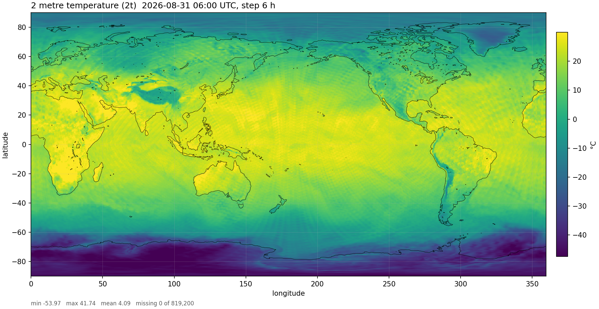
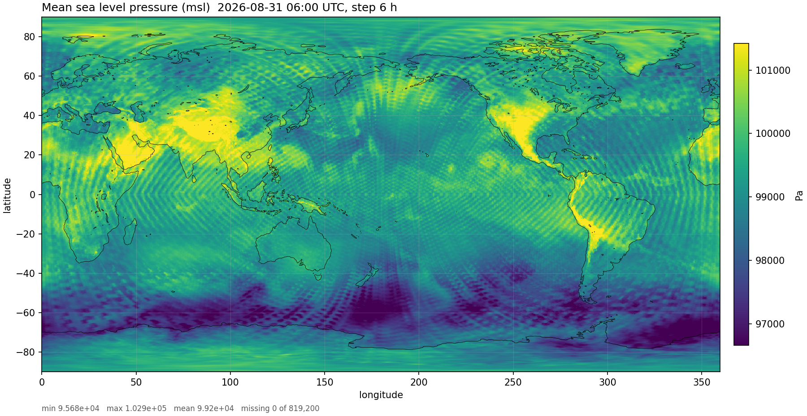
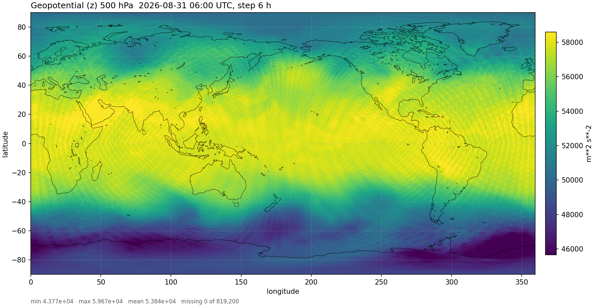
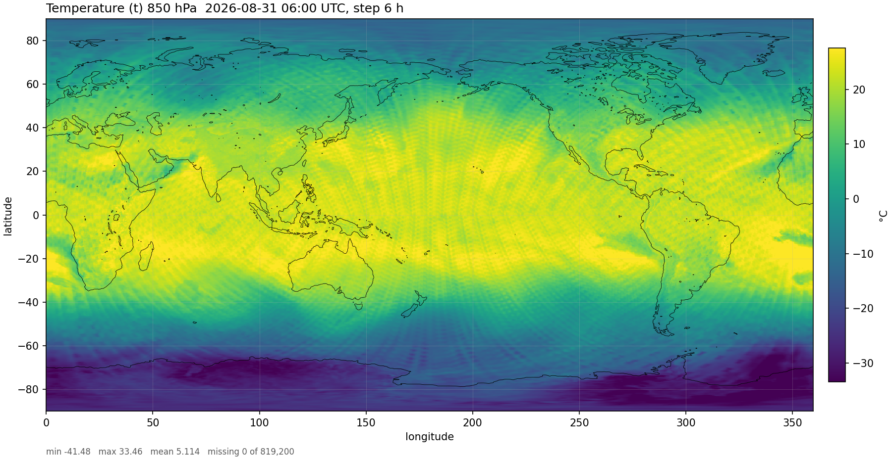
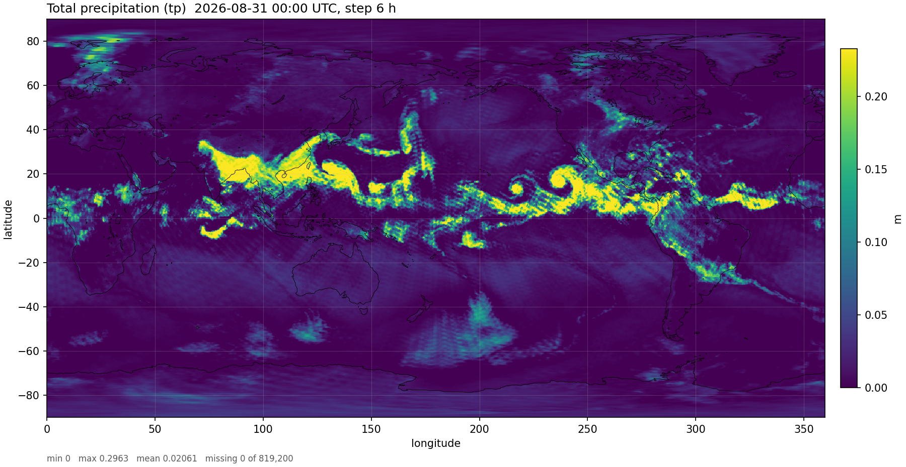
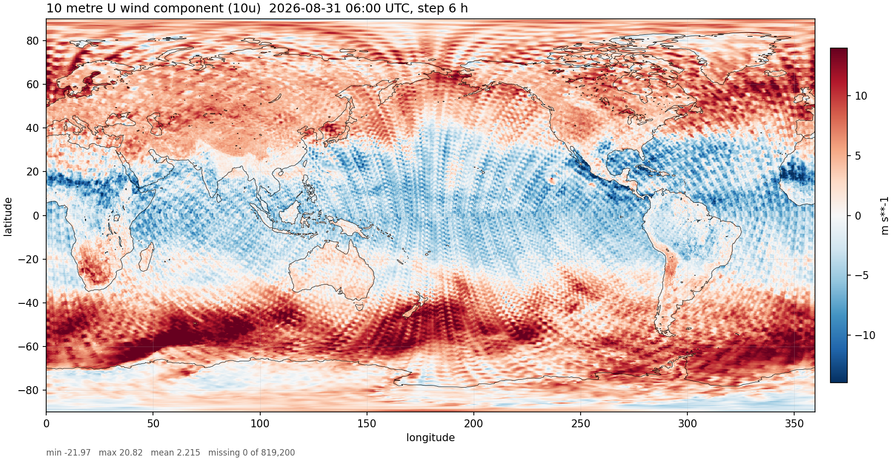
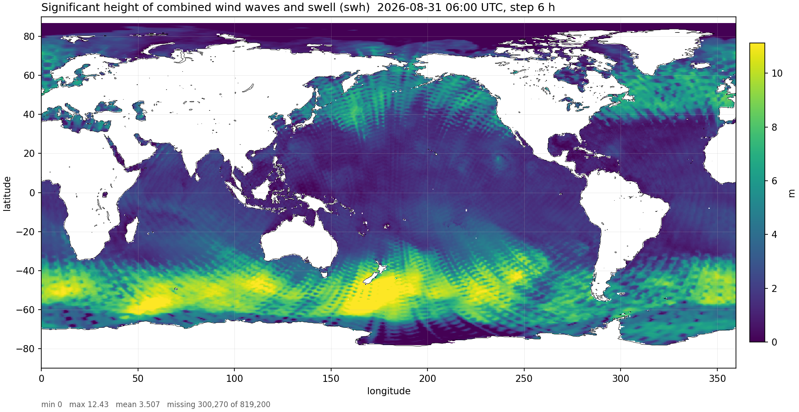
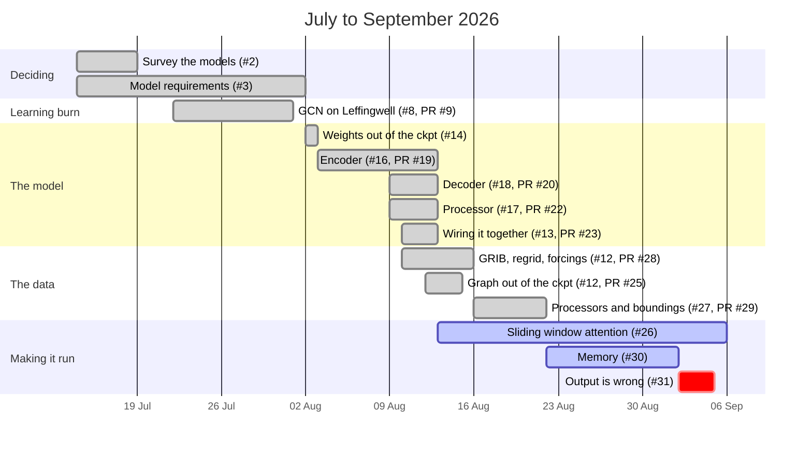

# Airglow - Rust Inference Engine for Medium Range Weather Forecasting

> This is based on [AIFS single v2](https://huggingface.co/ecmwf/aifs-single-2.0)
> (`aifs-single-2.0`). The weights, the graph and the input data are ECMWF's. The inference
> engine is ours, written in Rust on [burn](https://burn.dev).



Airglow takes the two ECMWF open-data analyses the model wants (t-6h and t0), runs one 6 h step of
AIFS single v2 over the 542,080-point N320 grid, and writes the result as GRIB2 that ecCodes and
earthkit read like any other forecast. The forward pass is checked stage by stage against the
PyTorch model: correlation 1.000000 out of the encoder and 0.999998 by the sixteenth processor
block ([`correlation.txt`](static/correlation.txt)). It is not finished, some issues are listed: 
- [ ] the output drifts from anemoi's in the decoder ([#33](https://github.com/Murukulu/airglow/issues/33))
- [ ] the processor runs full rather than sliding-window attention ([#26](https://github.com/Murukulu/airglow/issues/26))
- [ ] auto-regression is not supported right now (we need to just run the model in a loop) ([#35](https://github.com/Murukulu/airglow/issues/26))
- [ ] we should improve the CLI ([#34](https://github.com/Murukulu/airglow/issues/34))
- [ ] we should reduce the memory footprint of the model, it currently takes about 35-40GB VRAM ([#30](https://github.com/Murukulu/airglow/issues/30))

but every map on this page came out of this code.

The details around [how it got built](#how-this-got-built) is closer to the bottom, this shows the git issues, which was my
main mechanism for tracking work and writing up notes and any PRs I created. There is also a Gantt chart with a rough timeline.
I suggest going to issues that you find interesting as I've tried to maintain a rich (but rough) set of "what am I up to" and
"what problem am I facing, how did I resolve it" self-conversations.

The instructions for [building](#build-and-run) and [testing](#tests) are closer to the bottom.

> AI Disclaimer:
> This model was built with the help of AI but the primary effort was done by me. AI helped me with debugging issues; 
> discussing thoughts around design; script generation; and some code cleanup. You can see my specific journey and effort
> at [How it got built](#how-this-got-built).

## Overview of what's in here

- Encoder $\to$ 16-layer transformer processor $\to$ decoder. This matches anemoi `models-0.9.3`, the version
  the checkpoint (point in time of creation) was trained with. `1024` channels, `16` heads, `253M` parameters.
- Both bipartite graphs read straight out of the checkpoint's `HeteroData` as safetensors:
  `748,348` `data.hidden` edges and `1,626,240` `hidden.data`, onto a `40,320`-node hidden mesh.
- `graph_transformer_conv` ([UniMP](https://arxiv.org/abs/2009.03509) equivalent) with a per-destination-node softmax (sparse segment softmax). burn's scatter only sums,
  so `scatter_max` is a small CubeCL kernel behind a crate `Backend` trait, registered through
  Fusion so it works under `burn::backend::Cuda`.
- Multi-head self-attention (MHA) on burn's fused attention kernel. burn's own
  `MultiHeadAttention` biases q/k/v and can't carry these weights, so it was not compatible here.
- Checkpoint loading via `burn-store` with `PyTorchToBurnAdapter` and a key remap. The `.ckpt`
  becomes safetensors through a script that stubs `flash_attn` on unpickle which allowed me to avoid
  a dependency on installing flash attention as initial development was on a macbook, which does not
  have CUDA.
- Nine computed forcings, pre/post processors (normaliser, constant imputer, conditional
  NaN) and Relu / Hardtanh / Fraction boundings, all from the checkpoint's config.
- GRIB parsing through ecCodes. `lsm.grib` is GRIB1 on a reduced Gaussian grid and the forecast messages
  are `grid_ccsds`; none of the Rust GRIB crates decode either. 0.25° $\to$ N320 uses earthkit's
  precomputed sparse matrix, fetched once and applied in Rust.
- GRIB2 output by cloning anemoi's N320 template messages, one per variable, 119 of them.
- `AIFS_DUMP_DIR` writes every forward stage as raw f32; `scripts/ref_*.py` run the same stages in
  PyTorch and `compare_dump.py` diffs them.
- Not yet: sliding window attention, a CLI (input paths and the base time are constants), and
  rolling the 6 h step forward.

## Forecast fields

All 119 output variables for 2026-08-31 06:00 UTC, 6 h after the analysis. A selection:

<table>
  <tr>
    <td></td>
    <td></td>
  </tr>
  <tr>
    <td align="center"><sub>mean sea level pressure (<code>msl</code>)</sub></td>
    <td align="center"><sub>geopotential, 500 hPa (<code>z-500</code>)</sub></td>
  </tr>
  <tr>
    <td></td>
    <td></td>
  </tr>
  <tr>
    <td align="center"><sub>temperature, 850 hPa (<code>t-850</code>)</sub></td>
    <td align="center"><sub>total precipitation (<code>tp</code>)</sub></td>
  </tr>
  <tr>
    <td></td>
    <td></td>
  </tr>
  <tr>
    <td align="center"><sub>10 m u wind (<code>10u</code>)</sub></td>
    <td align="center"><sub>significant wave height (<code>swh</code>)</sub></td>
  </tr>
</table>

<details>
<summary>All 119 fields</summary>

**Surface**

[2t](static/images/2t.png) ·
[2d](static/images/2d.png) ·
[10u](static/images/10u.png) ·
[10v](static/images/10v.png) ·
[100u](static/images/100u.png) ·
[100v](static/images/100v.png) ·
[msl](static/images/msl.png) ·
[sp](static/images/sp.png) ·
[skt](static/images/skt.png) ·
[tcc](static/images/tcc.png) ·
[lcc](static/images/lcc.png) ·
[mcc](static/images/mcc.png) ·
[hcc](static/images/hcc.png) ·
[tcw](static/images/tcw.png) ·
[tp](static/images/tp.png) ·
[cp](static/images/cp.png) ·
[sf](static/images/sf.png) ·
[sd](static/images/sd.png) ·
[ro](static/images/ro.png) ·
[ssrd](static/images/ssrd.png) ·
[strd](static/images/strd.png) ·
[stl1](static/images/stl1.png) ·
[stl2](static/images/stl2.png) ·
[swvl1](static/images/swvl1.png) ·
[swvl2](static/images/swvl2.png) ·
[fscov](static/images/fscov.png)

**Pressure levels** (hPa)

| | 10 | 50 | 100 | 150 | 200 | 250 | 300 | 400 | 500 | 600 | 700 | 850 | 925 | 1000 |
|---|---|---|---|---|---|---|---|---|---|---|---|---|---|---|
| `t` temperature | [10](static/images/t-10.png) | [50](static/images/t-50.png) | [100](static/images/t-100.png) | [150](static/images/t-150.png) | [200](static/images/t-200.png) | [250](static/images/t-250.png) | [300](static/images/t-300.png) | [400](static/images/t-400.png) | [500](static/images/t-500.png) | [600](static/images/t-600.png) | [700](static/images/t-700.png) | [850](static/images/t-850.png) | [925](static/images/t-925.png) | [1000](static/images/t-1000.png) |
| `u` wind | [10](static/images/u-10.png) | [50](static/images/u-50.png) | [100](static/images/u-100.png) | [150](static/images/u-150.png) | [200](static/images/u-200.png) | [250](static/images/u-250.png) | [300](static/images/u-300.png) | [400](static/images/u-400.png) | [500](static/images/u-500.png) | [600](static/images/u-600.png) | [700](static/images/u-700.png) | [850](static/images/u-850.png) | [925](static/images/u-925.png) | [1000](static/images/u-1000.png) |
| `v` wind | [10](static/images/v-10.png) | [50](static/images/v-50.png) | [100](static/images/v-100.png) | [150](static/images/v-150.png) | [200](static/images/v-200.png) | [250](static/images/v-250.png) | [300](static/images/v-300.png) | [400](static/images/v-400.png) | [500](static/images/v-500.png) | [600](static/images/v-600.png) | [700](static/images/v-700.png) | [850](static/images/v-850.png) | [925](static/images/v-925.png) | [1000](static/images/v-1000.png) |
| `w` vertical velocity | [10](static/images/w-10.png) | [50](static/images/w-50.png) | [100](static/images/w-100.png) | [150](static/images/w-150.png) | [200](static/images/w-200.png) | [250](static/images/w-250.png) | [300](static/images/w-300.png) | [400](static/images/w-400.png) | [500](static/images/w-500.png) | [600](static/images/w-600.png) | [700](static/images/w-700.png) | [850](static/images/w-850.png) | [925](static/images/w-925.png) | [1000](static/images/w-1000.png) |
| `q` specific humidity | | [50](static/images/q-50.png) | [100](static/images/q-100.png) | [150](static/images/q-150.png) | [200](static/images/q-200.png) | [250](static/images/q-250.png) | [300](static/images/q-300.png) | [400](static/images/q-400.png) | [500](static/images/q-500.png) | [600](static/images/q-600.png) | [700](static/images/q-700.png) | [850](static/images/q-850.png) | [925](static/images/q-925.png) | [1000](static/images/q-1000.png) |
| `z` geopotential | [10](static/images/z-10.png) | [50](static/images/z-50.png) | [100](static/images/z-100.png) | [150](static/images/z-150.png) | [200](static/images/z-200.png) | [250](static/images/z-250.png) | [300](static/images/z-300.png) | [400](static/images/z-400.png) | [500](static/images/z-500.png) | [600](static/images/z-600.png) | [700](static/images/z-700.png) | [850](static/images/z-850.png) | [925](static/images/z-925.png) | [1000](static/images/z-1000.png) |

**Wave**

[swh](static/images/swh.png) ·
[mwp](static/images/mwp.png) ·
[mwd](static/images/mwd.png) ·
[cdww](static/images/cdww.png) ·
swell height by period band:
[10–12 s](static/images/h1012.png) ·
[12–14 s](static/images/h1214.png) ·
[14–17 s](static/images/h1417.png) ·
[17–21 s](static/images/h1721.png) ·
[21–25 s](static/images/h2125.png) ·
[25–30 s](static/images/h2530.png)

</details>

## How this got built

14 July to 5 September 2026. 23 issues, 9 PRs, 52 commits, eight design and review docs in
[`docs/`](docs/), 54 tests. Ai helped with the docs, a fair share of the tests and the GRIB loader
towards the end.



| When | Issue | What happened |
|---|---|---|
| 14–19 Jul | [#1](https://github.com/Murukulu/airglow/issues/1), [#2](https://github.com/Murukulu/airglow/issues/2), [#3](https://github.com/Murukulu/airglow/issues/3) | Read up on Aurora, AIFS, Earth-2, EPT-2. Nowcasting is more or less solved and we'd add nothing over BBC weather; medium-range is where three days' notice actually changes what you can do. Picked AIFS knowing it was the harder one, with a three-week bail-out to Aurora we never used. |
| 22 Jul–1 Aug | [#8](https://github.com/Murukulu/airglow/issues/8) | A GCN on the Leffingwell odour dataset to learn burn. SMILES $\to$ graph, PyG-style batching by offsetting node indices into one big disconnected graph. Trains, about 64 on hamming score; good enough for what it was for. |
| 1–2 Aug | [#10](https://github.com/Murukulu/airglow/issues/10), [#14](https://github.com/Murukulu/airglow/issues/14) | Pulled the model summary out of the ckpt metadata: 253M parameters, encoder $\to$ 16 processor blocks $\to$ decoder. The ckpt won't unpickle without `flash_attn`, which has no mac build; stubbing the class on unpickle got safetensors out. Split the rest into one ticket per module. |
| 2–15 Aug | [#16](https://github.com/Murukulu/airglow/issues/16) | The wall. PyG's `MessagePassing` is thirty-odd methods of dispatch around one function, so it didn't get ported. Then burn's scatter turned out to only sum, and the softmax here is over each node's incoming edges, not the whole tensor. `graph_transformer_conv` and the segment softmax came out of about a week on this; the working-out is in [`docs/graph-transformer-explained.md`](docs/graph-transformer-explained.md). |
| 9–15 Aug | [#17](https://github.com/Murukulu/airglow/issues/17), [#18](https://github.com/Murukulu/airglow/issues/18) | Processor: burn has no windowed attention and its `MultiHeadAttention` can't carry these weights, so a hand-written MHA, full attention for now ([#26](https://github.com/Murukulu/airglow/issues/26)). Decoder: a thin wrapper around the proc block, done in a day. |
| 10–16 Aug | [#12](https://github.com/Murukulu/airglow/issues/12) | The input side, which turned out bigger than the model. Anemoi ships the graph inside the pickle, so it comes out as safetensors (748,348 + 1,626,240 edges). Open data is 0.25° and the model is N320, so earthkit's regrid matrix, extracted offline, with a 720-column rotation because the two disagree on where longitude starts. None of the Rust GRIB crates read these files; ecCodes does. Nine forcings, three silent date bugs found on the way. |
| 13–22 Aug | [#27](https://github.com/Murukulu/airglow/issues/27) | Normaliser, imputer, conditional NaN, and the three boundings. Two ordering bugs: a `HashSet` where order was the contract (`2t` landed on channel 53 one run and 33 the next), and the imputer running before the NaN mask was recorded, which made the inverse do nothing. |
| 22 Aug–2 Sep | [#30](https://github.com/Murukulu/airglow/issues/30) | The full forward is ~27 GB of activations; the laptop has 18. Profiled it down to a fusion channel that never drains. Didn't fix it -- got access to a bigger GPU instead. |
| 2–5 Sep | [#31](https://github.com/Murukulu/airglow/issues/31) | It ran, and the output was wrong. Dumped every stage and diffed against PyTorch: the encoder softmax was shifting by a global max, so 15 of 16 heads underflowed to zero -- a case I'd left a comment about and then ignored. Wrote the `scatter_max` kernel. Then the processor: burn's flash attention reads a `swap_dims` query with the wrong row pitch. Copy it contiguous and block 15 correlates at 0.999998. Should have built the compare harness on day one. |
| open | [#26](https://github.com/Murukulu/airglow/issues/26), [#32](https://github.com/Murukulu/airglow/issues/32), [#33](https://github.com/Murukulu/airglow/issues/33) | Sliding window attention; whether only the query needs the contiguous copy; error growing through the later processor blocks and into the decoder (0.96 correlation at the decoder output). |

<details>
<summary>Every issue and PR</summary>

| # | Issue | Opened $\to$ closed | |
|---|---|---|---|
| [#1](https://github.com/Murukulu/airglow/issues/1) | Ideas for final product | 14 Jul $\to$ *open* | farming advice by SMS, aviation, grid load, heatwaves |
| [#2](https://github.com/Murukulu/airglow/issues/2) | Look at current SOTA weather models | 14 Jul $\to$ 19 Jul | Aurora, AIFS, Earth-2, EPT-2, plus a crash course in what a forecast is |
| [#3](https://github.com/Murukulu/airglow/issues/3) | Identify model requirements | 14 Jul $\to$ 2 Aug | open weights, write an inference engine, fine-tuning later |
| [#4](https://github.com/Murukulu/airglow/issues/4) | Type up meeting notes | 19 Jul $\to$ 2 Aug | `meeting_notes/` |
| [#5](https://github.com/Murukulu/airglow/issues/5) | AIFS v1 paper review | 19 Jul $\to$ *open* | |
| [#6](https://github.com/Murukulu/airglow/issues/6) | AIFS v2 paper review | 19 Jul $\to$ *open* | first read: input $\to$ LN $\to$ enc $\to$ proc ×16 $\to$ dec $\to$ LN |
| [#7](https://github.com/Murukulu/airglow/issues/7) | (Tom) GNN in burn | 19 Jul $\to$ *open* | MUTAG |
| [#8](https://github.com/Murukulu/airglow/issues/8) | (Sai) GNN in burn | 19 Jul $\to$ 1 Aug | Leffingwell GCN, `gnn_leffingwell_odor/` |
| [#10](https://github.com/Murukulu/airglow/issues/10) | Implementing AIFS v2 single | 1 Aug $\to$ 2 Sep | the root ticket; closed when it produced output |
| [#11](https://github.com/Murukulu/airglow/issues/11) | How the data input is ingested | 2 Aug $\to$ 10 Aug | folded into #12 |
| [#12](https://github.com/Murukulu/airglow/issues/12) | Representation of HeteroGraph | 2 Aug $\to$ 16 Aug | became the whole input side: graph, GRIB, N320, regrid, forcings |
| [#13](https://github.com/Murukulu/airglow/issues/13) | Model components and forward pass | 2 Aug $\to$ 15 Aug | parent of #15–#18 |
| [#14](https://github.com/Murukulu/airglow/issues/14) | Parse model weights | 2 Aug $\to$ 2 Aug | ckpt $\to$ safetensors, `flash_attn` stubbed on unpickle |
| [#15](https://github.com/Murukulu/airglow/issues/15) | NamedNodesAttributes | 2 Aug $\to$ 15 Aug | lat/lon features + trainable tensors per node set |
| [#16](https://github.com/Murukulu/airglow/issues/16) | GraphTransformerForwardMapper | 2 Aug $\to$ 15 Aug | the encoder; `graph_transformer_conv`, segment softmax |
| [#17](https://github.com/Murukulu/airglow/issues/17) | TransformerProcessor | 2 Aug $\to$ 15 Aug | 16 blocks, no sliding window yet |
| [#18](https://github.com/Murukulu/airglow/issues/18) | GraphTransformerBackwardMapper | 2 Aug $\to$ 15 Aug | the decoder; thin wrapper around the proc block |
| [#26](https://github.com/Murukulu/airglow/issues/26) | Use sliding window attention | 13 Aug $\to$ *open* | window of 1120 nodes; needs a kernel |
| [#27](https://github.com/Murukulu/airglow/issues/27) | Pre/post-processor and boundings | 13 Aug $\to$ 22 Aug | normaliser, imputer, conditional NaN, Relu/Hardtanh/Fraction |
| [#30](https://github.com/Murukulu/airglow/issues/30) | Memory issues | 22 Aug $\to$ *open* | ~27 GB forward vs 18 GB laptop; non-blocking on a bigger GPU |
| [#31](https://github.com/Murukulu/airglow/issues/31) | Model output is quite wrong | 2 Sep $\to$ 5 Sep | global-max softmax $\to$ `scatter_max`; strided query $\to$ contiguous |
| [#32](https://github.com/Murukulu/airglow/issues/32) | Strided tensor vs burn attention | 5 Sep $\to$ *open* | why the flash query reader ignores `swap_dims` strides |
| [#33](https://github.com/Murukulu/airglow/issues/33) | Error propagation in later proc blocks | 5 Sep $\to$ *open* | drift grows block by block, 0.96 at the decoder |

| PR | Branch | Merged | For |
|---|---|---|---|
| [#9](https://github.com/Murukulu/airglow/pull/9) | `sai-wip-gnn` | 1 Aug | #8 |
| [#19](https://github.com/Murukulu/airglow/pull/19) | `sai-wip-graph-transformer-forward-mapper` | 13 Aug | #16 |
| [#20](https://github.com/Murukulu/airglow/pull/20) | `sai-wip-graph-transformer-backward-mapper` | 13 Aug | #18 |
| [#22](https://github.com/Murukulu/airglow/pull/22) | `sai-wip-graph-transformer-processor` | 13 Aug | #17 |
| [#23](https://github.com/Murukulu/airglow/pull/23) | `sai-wip-aifs-v2` | 13 Aug | #13 |
| [#24](https://github.com/Murukulu/airglow/pull/24) | `sai-wip-named-node-attributes` | 13 Aug | #15 |
| [#25](https://github.com/Murukulu/airglow/pull/25) | `sai-wip-heterodata` | 15 Aug | #12 |
| [#28](https://github.com/Murukulu/airglow/pull/28) | `forcings` | 16 Aug | #12 |
| [#29](https://github.com/Murukulu/airglow/pull/29) | `processors` | 20 Aug | #27 |

</details>

The longer thinking is in [`docs/`](docs/): what GRIB is and what's in these files, the input
pipeline spec, the graph transformer explained from the paper down, the encoder design note, and
reviews of all three modules against anemoi.

## Build and run

You need an NVIDIA GPU (`type MyBackend = Cuda;` in [`src/main.rs`](src/main.rs); swap it for
`Wgpu` on a machine without one), the nix-dev shell for ecCodes, and `uv` for the Python side.

```sh
nix develop                  # from the repo root: eccodes, proj, libclang
cd aifsv2
scripts/generate-data.sh     # creates all data needed; checkpoint from HuggingFace -> safetensors, graph, regrid matrix, GRIB pair
cargo run --release          # -> data/output/20260831000000-6h.grib2
```

ECMWF open data only keeps about four days, so on a fresh checkout pass a recent base time and
point the `OPER_PATH` / `WAVE_PATH` constants in `src/main.rs` at what it downloaded:

```sh
BASE_TIME=2026-09-05T00 scripts/generate-data.sh
```

To plot the output (this is how `static/images/` was made) and to diff the forward against
PyTorch stage by stage:

```sh
uv run scripts/plot_grib.py data/output/20260831000000-6h.grib2 --all -o static/images
AIFS_DUMP_DIR=data/dump cargo run --release   # every stage to data/dump/*.f32
python scripts/ref_forward.py                 # same stages from PyTorch; needs a venv with anemoi-models 0.9.3
python scripts/ref_processor.py --window None
python scripts/ref_decoder.py                
python scripts/compare_dump.py                # compare the model results to anemoi model (no sliding window)
```

## Tests

```sh
cargo test --release
```

Every test runs on the GPU. `build.rs` picks Cuda when the NVIDIA driver is loaded, else Wgpu but
never ndarray, because scatter-add with duplicate indices comes out right on the CPU by accident
and that is exactly the thing being tested. `AIFS_TEST_BACKEND=cuda|cuda-unfused|wgpu` overrides
it (`cuda-unfused` tells a Fusion problem apart from a kernel one). Cargo won't notice the hardware
changed, so `touch build.rs` after moving machines. `cargo test -- --ignored` adds the one test
that runs attention at the real `40,320`-node size.

54 tests in 13 files, roughly:

| What | Files | Checks |
|---|---|---|
| GPU kernels | `attention_test` | burn's flash attention against its own naive fallback, one test per strategy; the `swap_dims` query bug ([#32](https://github.com/Murukulu/airglow/issues/32)) is asserted to still fail so we notice when upstream fixes it |
| Model modules | `common_test`, `block_test`, `encoder_test`, `decoder_test`, `transformer_test`, `aifs_test` | shapes, both residuals, chunking, and that the Burn parameter tree matches the checkpoint's keys exactly |
| GRIB in and out | `grib_test`, `output_test` | routing to variable names, bitmap → NaN, the regrid against earthkit's matrix (and that skipping the 720-column longitude rotation is wrong), GRIB2 round-trip through ecCodes |
| Reference values | `forcings_test`, `processors_test` | the nine forcings against earthkit to 1e-6; normaliser and imputer invert to fp32 |
| Checkpoint metadata | `metadata_test`, `bounding_test` | MARS identities, accumulation flags and the boundings against the real `ai-models.json` |

Three tests read `data/quiet_grub/anemoi-metadata`, which `generate-data.sh` unpacks. Everything
else builds its own inputs.

