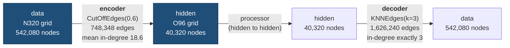
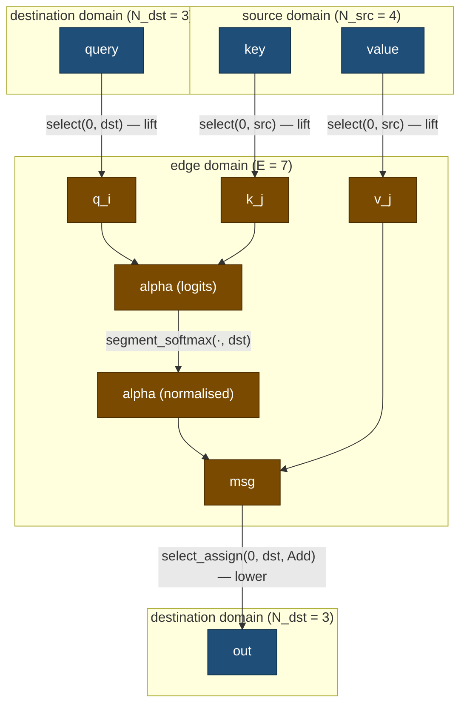

# The graph transformer, explained

Companion to [`graph-transformer-forward-mapper.md`](./graph-transformer-forward-mapper.md). That
document decides **what to build and why**; it assumes you already know what a bipartite
message-passing graph is. This one explains the object itself: where it comes from, what the
tensors mean, and why the softmax is the awkward part.

Read this first if any of the following is unclear: which paper this is, why `src` and `dst` have
the same length, why the head axis sits in the middle, or what `alpha` actually contains.

Every claim below cites a file and line. Upstream references are pinned to **anemoi-core
`0fa84c1`** and **PyTorch Geometric `cc678a3`** — the same commits the design note uses. Repo
paths are relative to `aifsv2/`.

---

## 1. The paper

**Shi, Huang, Sun, Xie, Zhang, Deng (2020) — _Masked Label Prediction: Unified Message Passing
Model for Semi-Supervised Classification_, [arXiv:2009.03509](https://arxiv.org/abs/2009.03509).**
Usually called **UniMP**.

Both upstreams name it in the class docstring, so this is not an inference:

- anemoi, `models/src/anemoi/models/layers/conv.py:84-88`:

  ```python
  class GraphTransformerConv(MessagePassing):
      """Message passing part of graph transformer operator.

      Adapted from 'Masked Label Prediction: Unified Message Passing Model for Semi-Supervised Classification'
      (https://arxiv.org/abs/2009.03509)
      """
  ```

- PyG, `torch_geometric/nn/conv/transformer_conv.py:27-30`: _"The graph transformer operator from
  the `"Masked Label Prediction: ..."` paper."_

### 1a. The two equations, mapped to identifiers

UniMP's operator, as PyG transcribes it (`transformer_conv.py:31-41`):

$$
alpha_{i,j} = softmax_{j in N(i)} ( (W3 x_i)^T (W4 x_j) / sqrt(d) )
$$

$$
x'_i = W1 x_i + sum_{j in N(i)} alpha_{i,j} W2 x_j
$$

Read `i` as the **destination** node and `j` as a **source** node feeding it. `N(i)` is the set of
sources with an edge into `i` — the sum runs over that set, not over all nodes. This is the entire
idea: standard scaled dot-product attention ([Vaswani et al. 2017](https://arxiv.org/abs/1706.03762)) where each query attends to its graph neighbours instead
of to every position.

| Paper             | anemoi                                   | This repo (`src/common.rs`)       |
| ----------------- | ---------------------------------------- | --------------------------------- |
| `W3 x_i`          | `lin_query(x_dst)` (`block.py:630`)      | `query`, `[N_dst, H, C]`          |
| `W4 x_j`          | `lin_key(x_src)` (`block.py:631`)        | `key`, `[N_src, H, C]`            |
| `W2 x_j`          | `lin_value(x_src)` (`block.py:632`)      | `value`, `[N_src, H, C]`          |
| `W1 x_i`          | `lin_self(x_dst)` — **outside** the conv | not an argument, see below        |
| `sqrt(d)`         | `self.out_channels**0.5` (`conv.py:142`) | `norm = 1/sqrt(C)`                |
| `alpha_{i,j}`     | `alpha` after `softmax` (`conv.py:144`)  | `alpha`, `[E, H, 1]`              |
| `sum_{j in N(i)}` | `aggr="add"` (`conv.py:97`)              | the final `select_assign(…, Add)` |

Two deltas between the paper and what `graph_transformer_conv` computes, both deliberate:

1. **The `W1 x_i` self term is not in the conv.** anemoi hoists it to the enclosing block, so the
   conv is a pure neighbour-aggregation with no residual. That is why the Rust signature takes no
   `x_dst` — see §5 Step 5 of the design note.
2. **Edge features are added to _both_ key and value.** `conv.py:139-147`:

   ```python
   if edge_attr is not None:
       key_j = key_j + edge_attr
   alpha = (query_i * key_j).sum(dim=-1) / self.out_channels**0.5
   alpha = softmax(alpha, index, ptr, size_i)
   return (value_j + edge_attr) * alpha.view(-1, heads, 1)
   ```

   The same projected `edges` tensor lands in the attention logit _and_ in the message being
   weighted. UniMP's formulation has no edge term at all; PyG's optional `edge_dim` adds it to the
   key and value separately. Easy to miss when reading, and both anemoi backends do it.

### 1b. Disambiguation: this is not the other "Graph Transformer"

Searching for "graph transformer paper" returns **Dwivedi & Bresson (2020), _A Generalization of
Transformer Networks to Graphs_, [arXiv:2012.09699](https://arxiv.org/abs/2012.09699)** first.
Same year, same name, **different operator** — it uses Laplacian eigenvector positional encodings
and does not condition values on edge features. It is not what anemoi implements. If you find
yourself reading about spectral positional encodings, you are in the wrong paper.

### 1c. Where the rest fits

| Reference                                                                 | Why it matters here                                                                                                                                                  |
| ------------------------------------------------------------------------- | -------------------------------------------------------------------------------------------------------------------------------------------------------------------- |
| Vaswani et al. 2017, [1706.03762](https://arxiv.org/abs/1706.03762)       | `softmax(QKᵀ/√d)V`. Make the graph complete and §1a collapses to exactly this.                                                                                       |
| Battaglia et al. 2018, [1806.01261](https://arxiv.org/abs/1806.01261)     | Origin of the message → aggregate → update decomposition that PyG's `MessagePassing` encodes as a class. §2 of the design note is about dissolving that abstraction. |
| Fey & Lenssen 2019, [1903.02428](https://arxiv.org/abs/1903.02428)        | PyG's design paper — why `gather`/`scatter` on an edge list is the chosen primitive rather than sparse matrix products.                                              |
| Lang et al. 2024, [2406.01465](https://arxiv.org/abs/2406.01465)          | AIFS itself. Why there is an encoder mapping a 542,080-point weather grid onto a 40,320-point one at all.                                                            |
| Lam et al. 2023, [2212.12794](https://arxiv.org/abs/2212.12794)           | GraphCast — the encode-process-decode pattern AIFS follows.                                                                                                          |
| Milakov & Gimelshein 2018, [1805.02867](https://arxiv.org/abs/1805.02867) | Online (single-pass) softmax: the running max and denominator. This is what the Triton path computes and what §7 below cannot express in stock Burn.                 |
| Dao et al. 2022, [2205.14135](https://arxiv.org/abs/2205.14135)           | FlashAttention. `_gt_fwd` in anemoi is this structure applied to a graph.                                                                                            |

---

## 2. The actual graph in this checkpoint

Two point clouds on a sphere, both **reduced Gaussian grids** — despite the name, the "hidden"
side of AIFS-single-mse-2.0 is not an icosahedral mesh.

From `data/aifs-single-mse-2.0_metadata.json`, under the key
`quiet_grub/anemoi-metadata/ai-models.json` → `config.graph`:

```json
"nodes": {
  "data":   { "node_builder": { "_target_": "anemoi.graphs.nodes.AnemoiDatasetNodes",
                                "dataset": ".../...-n320-2016-2025-6h-v1-for-single-v2.zarr" } },
  "hidden": { "node_builder": { "_target_": "anemoi.graphs.nodes.ReducedGaussianGridNodes",
                                "grid": "o96" } }
}
```

- **`data`** — the N320 reduced Gaussian grid, **542,080** points (~28 km spacing). This is where
  observations live.
- **`hidden`** — the O96 _octahedral_ reduced Gaussian grid. Its point count is exact and
  derivable: `4·96² + 36·96 = 36,864 + 3,456 =` **40,320** (~110 km spacing).



`GraphTransformerForwardMapper` — the subject of the design note — is the **encoder** arrow.

### 2a. The edge builders, and why they produce what they produce

From the same file, `config.graph.edges`:

```json
[
  {
    "source_name": "data",
    "target_name": "hidden",
    "edge_builders": [
      { "_target_": "anemoi.graphs.edges.CutOffEdges", "cutoff_factor": 0.6 }
    ]
  },
  {
    "source_name": "hidden",
    "target_name": "data",
    "edge_builders": [
      {
        "_target_": "anemoi.graphs.edges.KNNEdges",
        "num_nearest_neighbours": 3
      }
    ]
  }
]
```

**Encoder — `CutOffEdges`.** For each _hidden_ node, draw a ball of radius
`0.6 × (reference spacing)` and connect every data node inside it. A **radius query**: the number
of edges per hidden node is whatever geometry hands you, and it varies with latitude and grid
alignment.

**Decoder — `KNNEdges(k=3)`.** Each _data_ node takes its 3 nearest hidden nodes. Fixed degree.

That difference is the whole of §3 and §6 below. One produces variable-length groups; the other
produces uniform ones.

### 2b. Every number is confirmed by a checkpoint tensor

These are not estimates. `uv run scripts/parse_safetensors.py --query trainable`, run from
`aifsv2/`:

```
model.node_attributes.trainable_tensors.data.trainable     [542080, 8]
model.node_attributes.trainable_tensors.hidden.trainable   [40320, 8]
model.encoder.trainable.trainable                          [748348, 8]
model.decoder.trainable.trainable                          [1626240, 8]
```

Each row is 8 learned features attached to one node or one edge, so the leading dimension _is_ the
count:

| Symbol        | Value     | Source                                                |
| ------------- | --------- | ----------------------------------------------------- |
| `N_src`       | 542,080   | `...trainable_tensors.data` — matches N320            |
| `N_dst`       | 40,320    | `...trainable_tensors.hidden` — matches `4·96²+36·96` |
| `E` (encoder) | 748,348   | `model.encoder.trainable`                             |
| `E` (decoder) | 1,626,240 | `model.decoder.trainable`                             |

The decoder row is the useful one: **1,626,240 = 3 × 542,080 exactly**. A checkpoint tensor whose
first dimension is precisely `k × N_data` for the configured `k = 3` confirms the whole reading —
edges are per-(destination, neighbour) pairs, and `KNNEdges(k=3)` means each of the 542,080
destinations has exactly 3 of them.

Derived encoder degrees:

```
748,348 / 40,320  = 18.56   edges per hidden node   (destination in-degree)
748,348 / 542,080 =  1.38   edges per data node     (source out-degree)
```

The second number says most data points fall inside exactly one hidden node's ball, and a minority
fall inside two — consistent with balls of radius `0.6 ×` spacing overlapping slightly.

> **What we cannot state.** `edge_index` itself is **not** in the checkpoint —
> `parse_safetensors.py --query index` returns nothing. It is a non-persistent buffer loaded from
> `graph_enc_proc_dec_n320.pt` (`config.hardware.files.graph`), which this repo does not have. So
> **only the mean degree is derivable; the maximum is unknown.** Follow-up 2 in the design note
> (padded-dense softmax) depends on that maximum, and cannot be evaluated until the graph file is
> in hand.

---

## 3. Why `src` and `dst` are both length `E`

This is the question that unlocks everything else, and the answer is a reframing.

> **`src` and `dst` are not node lists. They are _edge_ attributes.**

There are `E` edges. Every edge has exactly one source and exactly one destination. So "the source
of each edge" is a list of `E` numbers, and "the destination of each edge" is a list of `E`
numbers. They are the same length because they are indexed by the same thing — the edge — not
because the two node sets are the same size.

What differs is not their **length** but their **value range**:

```
src : length E = 748,348     values in [0,  542,080)   <- indexes into `key`/`value`
dst : length E = 748,348     values in [0,   40,320)   <- indexes into `query`, and into the output
```

`src` is drawn from a set 13× larger than `dst`'s, so `dst` must repeat far more often. That
repetition is not a defect — see §6.

### 3a. It is one table, stored column-wise

The natural way to write an edge list is a row per edge. COO ("coordinate") format is that table
transposed into two parallel arrays:

```
         e=0    e=1    e=2    e=3    e=4    e=5    e=6   ...   e=E-1
       +------+------+------+------+------+------+------+     +--------+
src    | 4127 |  886 | 4127 |31005 |  886 |  205 |31005 | ... | 541990 |   <- in [0, N_src)
       +------+------+------+------+------+------+------+     +--------+
dst    |    0 |    0 |    0 |    1 |    2 |    2 |    2 | ... |  40319 |   <- in [0, N_dst)
       +------+------+------+------+------+------+------+     +--------+
          |                                                       
          +--> edge 0 runs from data node 4127 to hidden node 0
```

Read **down a column** to get one edge. Reading _along_ a row is what causes the confusion: `src`
in isolation looks like a list of nodes, but node `4127` appearing at both `e=0` and `e=2` is one
node with two outgoing edges, not two nodes.

Three sizes, three meanings, no arithmetic relationship forced between them:

|                   | Range of values                           | Length of the array                                           |
| ----------------- | ----------------------------------------- | ------------------------------------------------------------- |
| `N_src = 542,080` | how many distinct source nodes exist      | —                                                             |
| `N_dst = 40,320`  | how many distinct destination nodes exist | —                                                             |
| `E = 748,348`     | —                                         | how many (source, destination) pairs the cutoff rule produced |

`E` is set by geometry. It could legally be anything from `0` to `N_src × N_dst`; the cutoff radius
happens to yield 748,348.

---

## 4. `EdgeIndex`: COO and CSC, and why `colptr` is there

`src/graph.rs:7-14`:

```rust
pub struct EdgeIndex<B: Backend> {
    pub src: Tensor<B, 1, Int>, // Shape [E]
    pub dst: Tensor<B, 1, Int>, // [E]
    pub colptr: Vec<i64>,       // [N_ds+ 1]

    pub num_src: usize,
    pub num_dst: usize,
}
```

The struct holds **two representations of the same graph**: COO (`src`, `dst`) and the compressed
half of CSC (`colptr`). It is deliberately redundant.

### 4a. A worked example

Four source nodes, three destination nodes, seven edges. Say the builder emits them grouped by
source, which is the natural order for a "for each source, find its targets" loop:

```
edges:  (s0→d0) (s0→d2) (s1→d0) (s2→d1) (s2→d2) (s3→d0) (s3→d2)
```

**(a) Unsorted COO** — as built:

```
       e=  0    1    2    3    4    5    6
src      [ 0    0    1    2    2    3    3 ]
dst      [ 0    2    0    1    2    0    2 ]
```

**(b) Destination-sorted COO** — stable sort by `dst`. The permutation that achieves it is
`perm = [0, 2, 5, 3, 1, 4, 6]`:

```
       e=  0    1    2  |  3  |  4    5    6
src      [ 0    1    3  |  2  |  0    2    3 ]
dst      [ 0    0    0  |  1  |  2    2    2 ]
           \___________/   \_/   \___________/
            dst 0, deg 3   d1     dst 2, deg 3
```

The destination-sorted form has a property the unsorted one lacks: **each destination's edges are
one contiguous run.** Everything below depends on that.

**(c) CSC** — replace the run of repeated `dst` values with the offsets where each run starts.
Count edges per destination (`[3, 1, 3]`), then take the exclusive prefix sum with a trailing
total:

```
dst value      :   0    1    2
count          :   3    1    3
                   |    |    |
colptr         : [ 0,   3,   4,   7 ]        length N_dst + 1 = 4
                   ^         ^    ^
                   |         |    +-- colptr[N_dst] == E, always
                   |         +------- dst 2 owns edges [4, 7)
                   +----------------- dst 0 owns edges [0, 3)
```

To get every edge into destination `d`, slice `colptr[d] .. colptr[d+1]`. No search, no scan.

### 4b. `colptr` is not "the third part of CSC" — `dst` is the redundant one

This is the crux of the confusion. Strictly:

```
COO  =  (src, dst)              two arrays, both length E
CSC  =  (colptr, src)           colptr length N_dst+1, src length E
```

`src` is shared — in CSC terminology it is the **row index** array. Given a destination-sorted
edge list, `colptr` and `dst` carry **identical information** and each reconstructs the other:

```
dst → colptr :  bincount(dst, N_dst) then exclusive prefix sum
colptr → dst :  repeat_interleave(0..N_dst, colptr[1:] - colptr[:-1])
```

So the struct stores three arrays for two arrays' worth of information. That is a considered
choice, not an oversight:

- **Step 4 needs `dst` as a tensor.** `query.select(0, dst)` and
  `select_assign(0, dst, msg, Add)` both take a `Tensor<B, 1, Int>` of gather/scatter indices.
  `colptr` cannot be passed to either.
- **The CubeCL follow-up needs `colptr`.** A segmented kernel assigns one workgroup per
  destination and reads `colptr[d]..colptr[d+1]` to find its edges. With only `dst` it would have
  to search.
- **`colptr` is host-side (`Vec<i64>`) and cheap.** 40,321 × 8 bytes ≈ 320 KB, built once at graph
  load by a bincount and a prefix sum. Against 6 MB for `dst` on device, it rounds to nothing.

### 4c. `colptr` is only meaningful if the edges are destination-sorted

`graph.rs:5` says _"You can assume sorted by dest"_, and anemoi backs that up rather than assuming
it. `block.py:779-786`, the Triton path:

```python
csc, perm, reverse = edge_index_to_csc(
    edge_index,
    num_nodes=conv_size,
    reverse=True,
    edges_are_dst_sorted=edges_are_dst_sorted,
)
if perm is not None:
    edges = edges.index_select(0, perm)
```

If the edges are not already sorted, `edge_index_to_csc` returns a permutation and **the edge
feature tensor is physically reordered to match**. That is the cost of the CSC view, and the reason
`colptr` and an unsorted `dst` cannot coexist. Building `colptr` in Rust is where a
`debug_assert!` on sortedness belongs — see §5 Step 3 of the design note.

---

## 5. Why `[N, H, C]` and not `[H, N, C]`

Grouping by head sounds right — heads are independent, so why not make the head axis outermost?
The answer is that **anemoi uses both layouts**, and the choice tracks what the next operation is.

### 5a. Four reasons for node-major here

**1. The node axis must be axis 0 for the framework to gather it.** `conv.py:98`:

```python
super().__init__(node_dim=0, **kwargs)
```

PyG's `_lift` does `index_select(node_dim, index)`. With `[H, N, C]` you would need `node_dim=1`,
and then every scatter, every `softmax(…, dim=…)` and every size check would have to follow. The
port inherits the same constraint for a simpler reason: `Tensor::select(0, idx)` and
`select_assign(0, …)` are the operations, and axis 0 is where the node lives.

**2. The head split is free only in node-major order.** `block.py:645-651`:

```python
einops.rearrange(
    t,
    "nodes (heads vars) -> nodes heads vars",
    heads=self.num_heads,
    vars=self.out_channels_conv,
)
```

`lin_query` is a `Linear(1024, 1024)` producing `[N, 1024]`. Splitting the **last** axis is a pure
reinterpretation of the same bytes — no copy, no kernel:

```
one node's 1024 contiguous floats, as stored:

  offset:  0        64       128              960      1024
           |--------|--------|-- ... ---------|--------|
             head 0   head 1                    head 15
           \________________ view as [16, 64] ________/

  [N, 1024]  ->  [N, 16, 64]     same memory, stride (1024, 64, 1)
```

`block.py:687` reverses it just as cheaply. Reaching `[H, N, C]` instead means element `(h, n, c)`
must move to offset `h·N·C + n·C + c` — a real permutation of 542,080 × 1024 floats.

**3. The contracted axis has to be last.** `alpha = (q_i * k_j).sum_dim(-1)` reduces over `C`. In
`[E, H, C]` the `C` values of one (edge, head) pair are 64 adjacent floats — a coalesced read. Same
for the scatter: one destination's `H·C = 1024` outputs are one contiguous slab.

**4. Head-major buys nothing, because heads never interact.** They are independent all the way
through, so there is no operation that wants all of head `h` contiguous. Head-major would help if
something batched over heads — and that is exactly where anemoi does use it.

### 5b. The counterexample: anemoi _does_ go head-major, for one purpose

`block.py:706-712`, inside `shard_qkve_heads`:

```python
einops.rearrange(
    t,
    "(batch grid) (heads vars) -> batch heads grid vars",
    heads=self.num_heads,
    vars=self.out_channels_conv,
    batch=batch_size,
)
```

then splits across GPUs on the head axis, and immediately at `:724`:

```python
einops.rearrange(t, "batch heads grid vars -> (batch grid) heads vars")
```

Head-major exists **only** so `all_to_all_transpose` has heads as the outermost partitionable axis.
It is undone before the conv is ever called. The rule that emerges:

| Layout                       | Used when                                                                 | Example                                                  |
| ---------------------------- | ------------------------------------------------------------------------- | -------------------------------------------------------- |
| `[nodes, heads, vars]`       | the op indexes **nodes** — gather, scatter, segment softmax               | `block.py:645`, and every graph conv                     |
| `[batch, heads, grid, vars]` | the op partitions or batches over **heads** — collectives, batched matmul | `block.py:706` (sharding), `:847` (dense self-attention) |

Node-major is right here because every op in `graph_transformer_conv` is node- or edge-addressed.
Nothing batches over heads.

---

## 6. Duplicates, worked end to end

Take the seven-edge graph from §4a, with `H = 1` and `C = 2` so the arithmetic fits on a page.
Heads never interact (§5a), so `H > 1` changes only the shapes. Set `edges = 0` throughout to keep
the numbers clean; §1a explains where it would otherwise enter.

Inputs:

```
query  [N_dst=3, 1, 2]        key  [N_src=4, 1, 2]        value  [N_src=4, 1, 2]
  q[0] = (1, 0)                 k[0] = (1, 0)               v[0] = (10,  0)
  q[1] = (0, 1)                 k[1] = (0, 1)               v[1] = ( 0, 10)
  q[2] = (1, 1)                 k[2] = (1, 1)               v[2] = ( 5,  5)
                                k[3] = (2, 0)               v[3] = ( 1,  1)

edge_index (destination-sorted, from §4a(b)):
  src = [0, 1, 3, 2, 0, 2, 3]
  dst = [0, 0, 0, 1, 2, 2, 2]
  colptr = [0, 3, 4, 7]
```

### 6a. The domains, and which step moves between them



The design note's §2d diagram shows the same computation as a sequence of _operations_. This one
shows it as movement between _domains_ — three lifts in, one lower out. Every tensor in the middle
band is length 7.

### 6b. Step by step

**Gather.** `select(0, dst)` and `select(0, src)`. Note `q_i` repeats `q[0]` three times: rows 0-2
all come from destination 0.

| e | `src[e]` | `dst[e]` | `q_i = q[dst[e]]` | `k_j = k[src[e]]` | `v_j = v[src[e]]` |
| - | -------- | -------- | ----------------- | ----------------- | ----------------- |
| 0 | 0        | 0        | (1, 0)            | (1, 0)            | (10, 0)           |
| 1 | 1        | 0        | (1, 0)            | (0, 1)            | (0, 10)           |
| 2 | 3        | 0        | (1, 0)            | (2, 0)            | (1, 1)            |
| 3 | 2        | 1        | (0, 1)            | (1, 1)            | (5, 5)            |
| 4 | 0        | 2        | (1, 1)            | (1, 0)            | (10, 0)           |
| 5 | 2        | 2        | (1, 1)            | (1, 1)            | (5, 5)            |
| 6 | 3        | 2        | (1, 1)            | (2, 0)            | (1, 1)            |

Shapes: `[3,1,2]` and `[4,1,2]` both become `[7,1,2]`. Reads with duplicate indices are harmless.

**Logits.** `alpha = (q_i * k_j).sum_dim(-1) / sqrt(C)`, with `sqrt(2) = 1.4142`:

| e | `q_i · k_j` | `alpha` |
| - | ----------- | ------- |
| 0 | 1           | 0.7071  |
| 1 | 0           | 0.0000  |
| 2 | 2           | 1.4142  |
| 3 | 1           | 0.7071  |
| 4 | 1           | 0.7071  |
| 5 | 2           | 1.4142  |
| 6 | 2           | 1.4142  |

`[7, 1, 2] → [7, 1, 1]`. The channel axis is gone; one scalar per edge per head.

**Segment softmax.** Normalise **within each destination's run**, using `colptr = [0, 3, 4, 7]`:

```
segment for dst 0 = edges [0,3)   logits 0.7071, 0.0000, 1.4142
segment for dst 1 = edges [3,4)   logits 0.7071
segment for dst 2 = edges [4,7)   logits 0.7071, 1.4142, 1.4142
```

| e | dst | logit  | `exp(x − max_seg)` | `/ sum_seg` |
| - | --- | ------ | ------------------ | ----------- |
| 0 | 0   | 0.7071 | 0.4931             | **0.284**   |
| 1 | 0   | 0.0000 | 0.2431             | **0.140**   |
| 2 | 0   | 1.4142 | 1.0000             | **0.576**   |
|   |     |        | Σ = 1.7362         | Σ = 1.000   |
| 3 | 1   | 0.7071 | 1.0000             | **1.000**   |
|   |     |        | Σ = 1.0000         | Σ = 1.000   |
| 4 | 2   | 0.7071 | 0.4931             | **0.198**   |
| 5 | 2   | 1.4142 | 1.0000             | **0.401**   |
| 6 | 2   | 1.4142 | 1.0000             | **0.401**   |
|   |     |        | Σ = 2.4931         | Σ = 1.000   |

Three separate sums, each normalising to 1. Edge 3 gets weight exactly `1.000` because it is the
only edge into destination 1 — a one-element softmax is always 1.

**Weight and scatter.** `msg = v_j * alpha`, then add into the output row named by `dst`:

```
 msg[0] = (10, 0)  × 0.284 = ( 2.840, 0.000 )  ──┐
 msg[1] = ( 0,10)  × 0.140 = ( 0.000, 1.400 )  ──┼──> out[0] = ( 3.416, 1.976 )
 msg[2] = ( 1, 1)  × 0.576 = ( 0.576, 0.576 )  ──┘

 msg[3] = ( 5, 5)  × 1.000 = ( 5.000, 5.000 )  ─────> out[1] = ( 5.000, 5.000 )

 msg[4] = (10, 0)  × 0.198 = ( 1.980, 0.000 )  ──┐
 msg[5] = ( 5, 5)  × 0.401 = ( 2.005, 2.005 )  ──┼──> out[2] = ( 4.386, 2.406 )
 msg[6] = ( 1, 1)  × 0.401 = ( 0.401, 0.401 )  ──┘
```

`[7, 1, 2] → [3, 1, 2]` = `[N_dst, H, C]`. Because the weights in each segment sum to 1, every
output row is a **convex combination** of its incoming `v_j` rows — a weighted average of the
source values, never an extrapolation.

### 6c. The collision, made explicit

The last step is where duplicate indices stop being a curiosity:

```
                   dst = [0, 0, 0, 1, 2, 2, 2]
                          \  |  /
msg[0] ──┐                 \ | /
msg[1] ──┼──> += ──> out[ 0 ]     three writes, one address
msg[2] ──┘
```

Three edges name output row 0. At the toy scale that is three; at production scale it is **18.6 on
average**, because `CutOffEdges` puts ~18.6 data points inside each hidden node's ball (§2a).

The duplicates **are** the segments. They are not an artifact to be designed around:

- Without them, every segment would have size 1, every softmax weight would be `1.000`, and the
  layer would reduce to a per-edge copy — no attention at all.
- The decoder is the controlled comparison: `KNNEdges(k=3)` gives every destination exactly 3
  duplicates, so its segments are uniformly sized (§2b). Same mechanism, fixed group size.

If those three writes are issued by three threads with a non-atomic read-modify-write, two of them
are lost. That is the entire subject of §8, and of §5 Step 4 of the design note.

---

## 7. What `alpha` is, and what "segment" means

### 7a. Shape at every line

Following `conv.py:139-147` against the Rust in `src/common.rs:138-148`:

| After                         | anemoi                | Rust (Burn)       | Meaning                                |
| ----------------------------- | --------------------- | ----------------- | -------------------------------------- |
| gather                        | `query_i` `[E, H, C]` | `q_i` `[E, H, C]` | per edge, per head, a `C`-vector       |
| `sum(dim=-1)` / `sum_dim(-1)` | `[E, H]`              | `[E, H, 1]`       | per edge, per head, **one scalar**     |
| `softmax(…)`                  | `[E, H]`              | `[E, H, 1]`       | same, now normalised within segments   |
| `.view(-1, heads, 1)`         | `[E, H, 1]`           | — not needed      | ready to broadcast against `[E, H, C]` |

The rank difference is a real API difference, not a bug: **PyTorch's `sum` drops the reduced axis;
Burn's `sum_dim` keeps it.** That is why anemoi needs the `.view` at `conv.py:147` and the port does
not. Verified: `sum_dim` returns `Self`, preserving the const-generic rank
(`burn-tensor-0.21.0/src/tensor/api/numeric.rs:451`).

So `alpha` is **one number per (edge, head)**. Not per channel — the channel axis was contracted
away by the dot product. It answers: _how much should this edge's message count, for this head?_

### 7b. Three softmaxes on the same numbers

Take the seven logits from §6b and normalise them three ways.

**(i) Over the channel axis** — `activation::softmax(alpha, 2)`. `alpha` is `[7, 1, 1]`; the last
axis has extent 1. Softmax of a one-element vector is `1.0`. Every entry becomes `1.000`. A no-op.
The channel information is already gone; there is nothing to normalise.

**(ii) Over all edges** — `activation::softmax(alpha, 0)`. One denominator for all seven:

| e | dst   | segment softmax | global softmax |
| - | ----- | --------------- | -------------- |
| 0 | 0     | 0.284           | 0.104          |
| 1 | 0     | 0.140           | 0.051          |
| 2 | 0     | 0.576           | 0.212          |
| 3 | **1** | **1.000**       | **0.104**      |
| 4 | 2     | 0.198           | 0.104          |
| 5 | 2     | 0.401           | 0.212          |
| 6 | 2     | 0.401           | 0.212          |

Look at edge 3. It is the sole edge into destination 1, so its message must pass through
undiminished — weight `1.000`. The global softmax gives it `0.104`, scaling destination 1's output
down by ~10× for no reason other than that six unrelated edges exist elsewhere in the graph. The
global version also makes every output depend on every other destination's logits, which destroys
locality: adding one edge anywhere changes every weight.

**(iii) Segment softmax** — the correct one. Column 3 above. Each destination's weights sum to
`1.000` independently.

### 7c. Why no `dim` argument can express it

`activation::softmax(tensor, dim)` normalises over **the full extent of one axis**. Segment
boundaries here are `colptr[d]..colptr[d+1]` — **variable-length runs inside axis 0**:

```
axis 0, length 7:

  [ e0  e1  e2 | e3 | e4  e5  e6 ]
    \________/   \/   \________/
      len 3     len 1    len 3      <- not an axis; extents differ per group
```

An axis has one extent. These runs have three. No `dim` names them, which is precisely why PyG
ships `torch_geometric.utils.softmax(src, index, ptr, num_nodes)` as a separate function rather
than reusing `torch.softmax`.

**The one escape.** If every destination had the _same_ degree `D`, the runs would be an axis: view
`[E, H, 1]` as `[N_dst, D, H, 1]` and call the builtin on axis 1. The decoder's `KNNEdges(k=3)`
graph satisfies this exactly. The encoder's `CutOffEdges` graph does not — and its maximum degree
is unknown (§2b), so the padded-dense variant of this trick cannot even be costed yet. That is
follow-up 2 in the design note.

---

## 8. Does PyTorch race?

PyG computes the per-segment maximum with `scatter`, `_softmax.py:84`:

```python
src_max = scatter(src.detach(), index, dim, dim_size=N, reduce="max")
out = src - src_max.index_select(dim, index)
out = out.exp()
out_sum = scatter(out, index, dim, dim_size=N, reduce="sum") + 1e-16
```

`index` is `dst`, with the same ~18.6-way duplicates. So the question is fair: if cubecl's
`scatter_nd` races on exactly this pattern, why doesn't PyTorch's?

**It has the same hazard and resolves it with atomics.** The trace:

1. `_softmax.py:84` calls `torch_geometric.utils.scatter`.
2. `_scatter.py:84-114` routes `reduce in ['min','max','amin','amax']` either to
   `Tensor.scatter_reduce_(dim, index, src, reduce='amax', include_self=False)` or to
   `torch_scatter.scatter`, depending on build and device.
3. The CUDA implementation is `aten/src/ATen/native/cuda/ScatterGatherKernel.cu`. Its reduction
   functors are one line each:

   ```cpp
   class ReduceMaximum {
     ...
     constexpr C10_DEVICE void operator() (scalar_t* self_data_start, int64_t index,
                                           int64_t numel, const scalar_t * src_data) const {
       gpuAtomicMax(self_data_start + index, *src_data);      // line 64
     }
   };
   ```

   `gpuAtomicMax` at `:64`, `gpuAtomicMin` at `:54`, `fastAtomicAdd` at `:35` and `:44`,
   `gpuAtomicMul` at `:26`. Every scatter reduction PyTorch offers is atomic.

That is the missing half of the design note's argument. The hazard is identical; the resolution is
not.

### 8a. Correct versus reproducible

Two different properties, and they come apart:

| Implementation                      | Correct? | Bit-reproducible? | Why                                                                                                                                                       |
| ----------------------------------- | -------- | ----------------- | --------------------------------------------------------------------------------------------------------------------------------------------------------- |
| torch `scatter_add_` (CUDA)         | yes      | **no**            | `fastAtomicAdd` serialises the updates, so nothing is lost — but float addition is not associative, so a different arrival order gives different rounding |
| torch `scatter_reduce_` amax (CUDA) | yes      | yes               | `gpuAtomicMax`. Max is commutative, associative **and idempotent**, so order cannot change the result at all                                              |
| cubecl `scatter_nd`, any op         | **no**   | no                | plain non-atomic load/store, `burn-cubecl-0.21.0/src/kernel/index/scatter_nd.rs:69-73`                                                                    |
| cubecl `select_assign`, `Add`       | yes      | yes               | one thread per output column, serial loop over the scattered axis, `select_assign.rs:49`                                                                  |

The cubecl `scatter_nd` kernel says what it does in its own doc comment (`scatter_nd.rs:16-17`):
_"Each thread handles one element across all update slices. Work items = num_updates \*
slice_size."_ With one thread per element and

```rust
let result = Op::BinaryOp::<T, Const<1>>::execute(
    Vector::cast_from(data[data_idx]),
    Vector::cast_from(values[val_offset]),
);
data[data_idx] = result[0];
```

there is nothing to serialise the eighteen threads that share a `data_idx`. `select_assign`
partitions the other way — `working_units = value.num_elements() / value.shape(axis)` — and then
loops `for i in 0..value.shape(axis)` **inside one thread**, so duplicates arrive in sequence.

The fourth row is worth stating plainly: **Burn's `select_assign` is _more_ reproducible than
PyTorch's `scatter_add_`**, and pays for it in parallelism — 1024 threads each walking all 748,348
edges. That is the exact trade §5 Step 4 of the design note makes.

### 8b. What this means for the port

- **Duplicates are not the problem. Non-atomicity is.** PyG does not avoid duplicate indices; it
  relies on a kernel that handles them.
- **This is why PyG can afford a true per-segment max and the port cannot.** `_softmax.py:84`
  works because `gpuAtomicMax` exists. Burn 0.21's `IndexingUpdateOp::Max` exists too, but only on
  `scatter_nd`, the primitive that races. The duplicate-safe primitives (`select_assign`,
  `scatter`) are `Add`-only, and that restriction sits in the kind layer
  (`burn-backend/src/tensor/ops/float.rs:114`) above the `Backend` trait, so no backend swap lifts
  it. Hence the global-max substitution in §5 Step 4 — mathematically exact, just not fused.
- **The reference fixture is a correctness oracle only.** PyG reaches `softmax` with `ptr = None`
  (§3b note 4 of the design note) and so takes this scatter path rather than the segment-pointer
  path. It is not a performance baseline.
- **A CPU-only test would hide all of this.** `burn-ndarray` accumulates correctly under every
  primitive — one sequential host loop, `burn-ndarray-0.21.0/src/ops/base.rs:236` — so a
  `scatter_nd`-based implementation passes on CPU and is silently wrong on `wgpu`. That is why §6
  of the design note tests on `wgpu`.

---

## 9. Glossary

| Symbol   | Domain                         | Meaning                                                                                  |
| -------- | ------------------------------ | ---------------------------------------------------------------------------------------- |
| `i`      | destination                    | The node receiving. PyG suffix `_i`; anemoi's `query_i`.                                 |
| `j`      | source                         | The node sending. PyG suffix `_j`; anemoi's `key_j`, `value_j`.                          |
| `N_src`  | —                              | Source node count. 542,080 (N320 grid).                                                  |
| `N_dst`  | —                              | Destination node count. 40,320 (O96 grid).                                               |
| `E`      | —                              | Edge count. 748,348 encoder, 1,626,240 decoder.                                          |
| `H`      | —                              | Attention heads. 16. Independent throughout.                                             |
| `C`      | —                              | Channels per head, `out_channels_conv`. 64. `H·C = 1024 = hidden_dim`.                   |
| `src`    | edge (length `E`)              | `src[e]` = source node of edge `e`, in `[0, N_src)`. CSC "row index".                    |
| `dst`    | edge (length `E`)              | `dst[e]` = destination node of edge `e`, in `[0, N_dst)`.                                |
| `colptr` | destination (length `N_dst+1`) | `colptr[d]..colptr[d+1]` = edge range owned by `d`. `colptr[N_dst] == E`.                |
| `alpha`  | edge                           | `[E, H, 1]`. One attention weight per edge per head, post-softmax.                       |
| segment  | —                              | The set of edges sharing a destination. Variable-length here; fixed at 3 in the decoder. |
| COO      | —                              | `(src, dst)` — two parallel per-edge arrays.                                             |
| CSC      | —                              | `(colptr, src)` — compressed destinations. Requires destination-sorted edges.            |

## Where to read next

[`graph-transformer-forward-mapper.md`](./graph-transformer-forward-mapper.md):

- **§2** — how PyG's 1035-line `MessagePassing` reduces to three gathers and one scatter, branch by
  branch.
- **§3** — the two anemoi reference implementations (PyG and Triton) and what each reveals.
- **§4** — checkpoint tensor inventory and the parameter shapes.
- **§5 Step 3-4** — `EdgeIndex` and `graph_transformer_conv`, with the full `scatter_nd` /
  `select_assign` / `segment_softmax` argument this document's §8 supplies the PyTorch half of.
- **§8** — the CubeCL segmented kernel follow-up, which removes both the global-max compromise and
  the 1024-thread bottleneck.

> **Current state of the code.** `src/common.rs:117-155` is mid-edit and does not compile: line 149
> calls `alpha.scatter_nd(indices, values, update)` with three undefined bindings and discards the
> result, and line 154 returns `alpha` at `[E, H, 1]` rather than the declared `[N_dst, H, C]`. The
> gather and logit steps (`:138-148`) match §6b above. Nothing from the design note's six
> implementation steps has landed yet.
