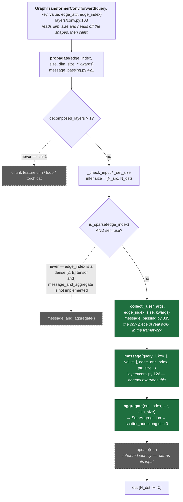
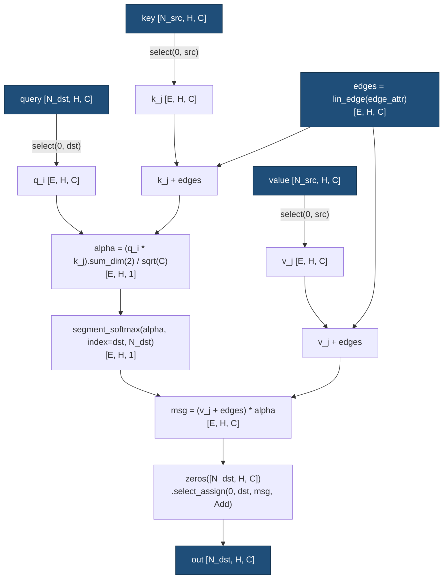

# Design note: `GraphTransformerForwardMapper` (issue #16)

_This document describes the changes to make. Nothing has been implemented yet._

Anemoi references are pinned to commit
[`0fa84c1`](https://github.com/ecmwf/anemoi-core/tree/0fa84c1f7105b526de903eaa45e975e929b6b58b);
paths are relative to `models/src/anemoi/models/`. PyG references are pinned to
[`cc678a3`](https://github.com/pyg-team/pytorch_geometric/tree/cc678a392255a1467872f54582724b8dce434603).

## 1. Context — why the PR stalled

The branch currently models PyG's `MessagePassing` as a Rust trait
(`aifsv2/src/encoder.rs:145`), with an `Adj` struct, a `GraphTransformerConvConfig`, and knobs
for `fuse`, `flow`, `aggr_type`, `node_dim`, and `decomposed_layers`. It doesn't compile, and
it's the reason the PR is stuck.

**None of it is needed.** Section 2 walks through why: `MessagePassing` is ~30 methods of
Python dispatch machinery wrapped around one user-supplied function, and every configuration
knob is a fixed constant for this model.

| Knob                | Value here         | Source                                                                          |
| ------------------- | ------------------ | ------------------------------------------------------------------------------- |
| `aggr`              | `"add"`            | `kwargs.setdefault("aggr", "add")`, `layers/conv.py:99`                         |
| `node_dim`          | `0`                | `super().__init__(node_dim=0, ...)`, `layers/conv.py:100`                       |
| `flow`              | `source_to_target` | PyG default → `_i` = `edge_index[1]`, `_j` = `edge_index[0]`                    |
| `fuse`              | `False`            | `self.fuse = inspector.implements('message_and_aggregate')`, and anemoi doesn't |
| `decomposed_layers` | `1`                | never set                                                                       |
| `dropout`           | `0.0` / inference  | `dropout(..., training=self.training)` is a no-op                               |

---

## 2. How `MessagePassing` actually works — and what is fluff

### 2a. The dispatch chain



Green = port to Rust. Grey/dashed = dead code on this path.

### 2b. `_collect` is the entire framework

Everything `MessagePassing` does that you can't see in `message()` happens here. It walks the
**parameter names** of your `message()` signature and, for each one:

- ends in `_j` → `kwargs[base].index_select(0, edge_index[0])` — gather at the **source**
- ends in `_i` → `kwargs[base].index_select(0, edge_index[1])` — gather at the **target**
- anything else → passed straight through
- plus four synthesised values: `index`, `ptr`, `size_i`, `dim_size`

That name-suffix convention is the reflection trick the whole class exists to support.

#### What `_collect` actually iterates

`propagate` passes `self._user_args` (`message_passing.py:514`), **not** `message`'s parameter
list. It is built once in `__init__`:

```python
self.inspector.inspect_signature(self.message)  # :140
self.inspector.inspect_signature(self.aggregate, exclude=[0, "aggr"])  # :141
self.inspector.inspect_signature(self.update, exclude=[0])  # :143
self._user_args = self.inspector.get_flat_param_names(
    ["message", "aggregate", "update"], exclude=self.special_args
)  # :146
```

`exclude=[0]` drops each function's first positional (`inputs`); `special_args` (:101) is
`{edge_index, adj_t, edge_index_i, edge_index_j, size, size_i, size_j, ptr, index, dim_size}`.
For anemoi that leaves

```
args = {heads, query_i, key_j, value_j, edge_attr}
```

— five entries. `index`/`ptr`/`size_i`/`dim_size` are stripped here and **synthesised at the
bottom** of `_collect` instead; that is the split the two tables below describe.

#### Branch-by-branch, for this conv

Entry state: `edge_index` is a plain int64 `Tensor [2, E]`; `_check_input` takes its
`elif isinstance(edge_index, Tensor)` arm with `size=None`, so `size = [None, None]`.
First line of the loop is `i, j = (1, 0) if flow == 'source_to_target' else (0, 1)` →
**`i = 1`, `j = 0`**; every later branch keys off these.

| arg         | branch taken            | `dim` | `_set_size` effect           | gather                                 |
| ----------- | ----------------------- | ----- | ---------------------------- | -------------------------------------- |
| `heads`     | no suffix → passthrough | —     | —                            | none — it is an `int`                  |
| `query_i`   | `_i` → `dim = i`        | 1     | `size[1] = N_dst`            | `query.index_select(0, edge_index[1])` |
| `key_j`     | `_j` → `dim = j`        | 0     | `size[0] = N_src`            | `key.index_select(0, edge_index[0])`   |
| `value_j`   | `_j` → `dim = j`        | 0     | already `N_src` → **checks** | `value.index_select(0, edge_index[0])` |
| `edge_attr` | no suffix → passthrough | —     | —                            | none — already per-edge `[E, H, C]`    |

**Three `index_select` calls, two passthroughs.** That is the whole of `_collect`'s loop for
this conv. `edge_attr` needing no `_j` is the point worth internalising: it is already indexed
by edge, so only the three _node_ tensors are lifted. Iteration 4 is also the only place PyG
silently validates that `value` and `key` agree on `N_src`.

Two in-loop branches are dead: the `isinstance(data, (tuple, list))` bipartite-pair unpacking
(anemoi passes q/k/v as three separate tensors — already resolved in `get_qkve`), and
`_set_size`'s mismatch `raise`. Inside `_lift`, only `elif isinstance(edge_index, Tensor)` is
reachable → `_index_select` → `_index_select_safe` → `src.index_select(0, index)`; the
`sparse_coo`/`sparse_csr`/`sparse_csc`/`SparseTensor` ladder above it never runs.

The post-loop three-way takes its **middle** arm (`elif isinstance(edge_index, Tensor)`), and
inside it the `isinstance(edge_index, EdgeIndex)` refinement is **skipped** — anemoi passes a
bare `Tensor`, so `ptr` stays `None` (see §3b note 4). Then the tail:

| synthesised | value                | Rust equivalent       |
| ----------- | -------------------- | --------------------- |
| `index`     | `edge_index[1]`      | `dst`                 |
| `ptr`       | `None`               | —                     |
| `size`      | `[N_src, N_dst]`     | `num_src` / `num_dst` |
| `size_i`    | `size[1]` = `N_dst`  | `edge_index.num_dst`  |
| `size_j`    | `size[0]` = `N_src`  | `edge_index.num_src`  |
| `dim_size`  | `= size_i` = `N_dst` | `num_dst`             |

Both `size_i`/`size_j` ternaries take the non-`None` arm, since the loop filled both slots.

#### Two arguments that go nowhere

- **`dim_size`.** `forward` passes `dim_size=query.shape[0]` into `propagate`
  (`layers/conv.py:103`), but `dim_size ∈ special_args`, so the loop never reads it from
  `kwargs`, and the tail then overwrites it with `size_i`. Same value (`N_dst` either way), so
  it is harmless — but if you are diffing the Rust against `forward`, that argument is dead.
- **`heads`.** Survives only so `message` can do `alpha.view(-1, heads, 1)`. Step 4 does not
  need it: Burn's `sum_dim` already keeps `[E, H, 1]`.

### 2c. Method-by-method verdict

`MessagePassing` (`torch_geometric/nn/conv/message_passing.py`) — ~30 public and private
methods, of which **three** matter:

| Method                                                                           | What it is                                                                                                     | Port?                                                  |
| -------------------------------------------------------------------------------- | -------------------------------------------------------------------------------------------------------------- | ------------------------------------------------------ |
| `_lift` :292                                                                     | `src.index_select(node_dim, edge_index[dim])`                                                                  | **Yes** — this _is_ `Tensor::select`                   |
| `_collect` :335                                                                  | the `_i`/`_j` gather + synthesised `index`/`ptr`/`size_i`/`dim_size`                                           | **Yes** — §2b                                          |
| `aggregate` :577                                                                 | delegates to `SumAggregation`                                                                                  | **Yes** — one `select_assign(0, dst, …, Add)`          |
| `__init__` :110                                                                  | builds `aggr_module` from `aggr="add"`; stores `flow`/`node_dim`; runs `Inspector` over your method signatures | No — the inspector only exists to make `_collect` work |
| `propagate` :421                                                                 | orchestrator: check → collect → message → aggregate → update, plus hook fan-out                                | No — inline the four steps                             |
| `message` :565                                                                   | the user hook; **anemoi overrides it**                                                                         | The override, yes. The base (`return x_j`), no.        |
| `update` :609                                                                    | `return inputs` — identity, never overridden                                                                   | No                                                     |
| `message_and_aggregate` :598                                                     | fused path; needs sparse `edge_index` **and** `fuse=True`                                                      | No — unreachable                                       |
| `_check_input` :204, `_set_size` :249                                            | infer `(N_src, N_dst)` when `size=None`                                                                        | No — store them on `EdgeIndex`                         |
| `_index_select` :263, `_index_select_safe` :269                                  | `index_select` plus a friendlier out-of-bounds error                                                           | No — a `debug_assert` at graph load covers it          |
| `edge_updater` :620, `edge_update` :668                                          | for convs that update _edge_ features                                                                          | No — unused                                            |
| `decomposed_layers` :681/:685                                                    | feature-dim chunking for memory                                                                                | No — `= 1`                                             |
| `explain` :708, `explain_message` :743                                           | Captum / GNNExplainer attribution                                                                              | No                                                     |
| 12 × `register_*_hook` :776–923                                                  | debugging hooks                                                                                                | No                                                     |
| `_set_jittable_templates` :926, `_get_*_signature` :1001/:1012, `jittable` :1023 | TorchScript codegen                                                                                            | No                                                     |
| `reset_parameters` :183, `__setstate__` :188, `__repr__` :194                    | plumbing                                                                                                       | No                                                     |

`GraphTransformerConv` (`layers/conv.py:84-145`) — only **three** methods exist, and it
overrides neither `aggregate`, `update`, nor `message_and_aggregate`:

| Method         | What it does                                                                   | Port?                                                                                   |
| -------------- | ------------------------------------------------------------------------------ | --------------------------------------------------------------------------------------- |
| `__init__` :92 | stores `out_channels` and `dropout`; sets `aggr="add"`, `node_dim=0`           | **No** — the conv has _zero_ parameters. In Rust it is a free function, not a `Module`. |
| `forward` :103 | reads `dim_size = query.shape[0]`, `heads = query.shape[1]`, calls `propagate` | Only as shape reads                                                                     |
| `message` :126 | the actual attention computation                                               | **Yes — this is the whole thing**                                                       |

**Sanity check from PyG's own history.** The first `MessagePassing`
([`f0e46f2`](https://github.com/pyg-team/pytorch_geometric/commit/f0e46f21f3ec0e53aeacd3f15591f3683388f461),
Dec 2018) was 38 lines, and the gather was hardcoded — no `Inspector`, no `_collect`:

```python
row, col = edge_index
out = self.messages(x[row], x[col], edge_attr)
out = scatter_(self.aggr, out, row, dim_size=x.size(0))
out = self.combine(x, out)  # `combine` later became `update`
```

The file is 1035 lines today. Everything in between is generality over things airglow has
exactly one of: arbitrary `*_i`/`*_j` argument names over many tensors (the one addition this
port needs, in its degenerate three-gather form), `flow`, bipartite pair inputs, size inference,
four `edge_index` layouts, `ptr`, sparse-value auto-fill, friendlier `IndexError`s, and
TorchScript/`torch.compile` forks. **The Step 4 body below is closer to this 2018 commit than to
current PyG** — three source tensors instead of one, and the flow convention flipped (the
original had `x_i = x[edge_index[0]]` and scattered to `row`; today's `source_to_target` default
makes `_i` = `edge_index[1]`).

### 2d. What the conv actually computes



Note the same projected `edges` tensor is added to **both** the key and the value — easy to
miss, and both reference backends do it.

### 2e. How much of PyG anemoi actually uses

Surveyed on `main` (the import lists are stable across the pinned commit). Across the whole
`models/` package the PyG runtime surface is three tiers, and only the third is computation:

1. **Type aliases — zero runtime.** `layers/block.py`, `layers/mapper.py`, `layers/processor.py`,
   `layers/attention.py`, `layers/graph_provider.py`, `distributed/khop_edges.py` and
   `triton/utils.py` import only `Adj`, `PairTensor`, `OptPairTensor`, `Size`, `OptTensor`. At
   the pinned PyG commit (`torch_geometric/typing.py:418-423`) these are
   `Adj = Union[Tensor, SparseTensor]`, `PairTensor = Tuple[Tensor, Tensor]`, and so on — the
   whole definition. **The branch's `Adj` struct is a two-arm type alias ported as a data
   structure**, which is §1's thesis in miniature.
2. **`HeteroData` as a container.** `layers/graph.py`, `layers/graph_provider.py`,
   `layers/residual.py`, `layers/ensemble.py`, `models/base.py`, `interface/__init__.py`. Graph
   _loading_, not compute — and exactly where §8 follow-up 1 lives.
3. **Actual computation — two files.** `layers/conv.py` imports `MessagePassing`, `softmax`,
   `scatter`; `triton/utils.py` imports `index_sort` and `index2ptr`.

Within tier 3, `scatter` is used only by **`GraphConv`** (`layers/conv.py:79`), a different
class in the same file for the GNN mapper variant; `GraphTransformerConv` does not override
`aggregate`, so it goes through `SumAggregation`. That leaves **`MessagePassing`** (dissolved by
§2b into three selects plus one scatter-add) and **`torch_geometric.utils.softmax`**
(`layers/conv.py:144`, Step 4). Two symbols — the entire PyG dependency of this port.

Note that `triton/utils.py` imports PyG too, so choosing the Triton backend does not escape the
dependency; it moves it from the inner loop to graph prep, where §5 Step 3 replaces it with a
prefix sum in plain Rust.

---

## 3. Reference implementations

### 3a. There are two, and they compute the same thing

`GraphTransformerBaseBlock` picks a backend at construction time (`layers/block.py:589-618`):

```python
graph_attention_backend: str = "triton"  # the DEFAULT
...
if not is_triton_available():  # no triton package, or no CUDA
    self.graph_attention_backend = "pyg"
if self.graph_attention_backend == "triton":
    self.conv = graph_transformer_attention_conv  # triton/gt.py
else:
    self.conv = GraphTransformerConv(...)  # layers/conv.py
```

`is_triton_available()` requires `torch.cuda.is_available()`, so **on a Mac the PyG path runs**,
but on ECMWF's GPUs the Triton path runs. Both matter, because they define the same function
with different memory schedules.

The switch buys exactly one object, and it is the parameterless one: `lin_query`/`lin_key`/
`lin_value`/`lin_self`/`lin_edge`, `projection`, `layer_norm_attention`, `layer_norm_mlp_dst`,
`node_dst_mlp` and the optional `edge_pre_mlp` are all constructed identically on both paths.
Every checkpoint tensor in §4 is backend-independent.

Three drifts on anemoi `main` — none change the design, but the line citation is stale:

- The selection has been factored out of `__init__` into **`set_attention_function()`**, so
  `layers/block.py:589-618` is correct only at the pinned commit.
- An env var, `ANEMOI_INFERENCE_GRAPHTRANSFORMER_ATTENTION_BACKEND`, can override the backend
  ahead of the `is_triton_available()` check. Irrelevant to airglow, but it means "Triton is the
  default" is really "…unless the deployment says otherwise".
- **The two convs are not signature-compatible.** `apply_gt` branches to build `args_conv`:
  Triton gets `(edges, csc, reverse)`, PyG gets `(edges, edge_index, conv_size)`. anemoi itself
  has to keep both layouts live to feed either backend — an argument for Step 3 carrying COO and
  CSC together.

**PyG backend** — §2d above: materialise one value per edge, then scatter.

**Triton backend** — `_gt_fwd` (`triton/gt.py:81-180`) runs one GPU program per **destination
node**, walking that node's incoming edges in CSC order with a flash-attention online softmax:
running max `m_i`, running denominator `l_i`, and an `exp(m_i - m_ij)` rescaling correction.

```
neigh_start, neigh_end = colptr[dst], colptr[dst+1]
if num_edges == 0: out[dst] = 0; return          # explicit zero-degree branch
q = Q[dst]; acc = 0; l_i = 0; m_i = -inf
for e_idx in neigh_start..neigh_end:
    e   = E[e_idx]                                # edge attrs, already in CSC order
    src = ROW[e_idx]
    k_e = K[src] + e ;  v_e = V[src] + e
    qk    = sum(q * k_e) / sqrt(C)
    m_ij  = max(m_i, qk)
    alpha = exp(qk - m_ij) ;  corr = exp(m_i - m_ij)
    acc   = acc * corr + alpha * v_e ;  l_i = l_i * corr + alpha ;  m_i = m_ij
out[dst] = acc / l_i
```

**The two are algebraically identical** — same `k + e`, same `v + e`, same `1/sqrt(C)`, same
per-destination normalisation. Implementing the PyG form is therefore _not_ "implementing the
slow fallback"; it is the same math with a different schedule. Two incidental differences: the
Triton kernel accumulates in fp32 regardless of input dtype (only matters if airglow ever runs
f16), and it stores `m_i + log(l_i)` for the backward pass (irrelevant to inference).

### 3b. What Triton tells us that PyG doesn't

1. **CSC, not COO, is the natural layout.** `edge_index_to_csc` (`triton/utils.py:25`) reduces
   to `colptr = index2ptr(dst, N_dst)` — a prefix sum over destination degrees — when
   `edges_are_dst_sorted=True`, which holds for graphs from anemoi's graph provider (`perm`
   comes back `None`, so `edges` needs no permutation). The `reverse` tuple (`rowptr`,
   `edge_ids`, `edge_dst`) exists **only for the backward pass**; an inference engine skips it.
2. **The memory blowup is not incidental.** With `E = 748,348`, `H = 16`, `C = 64`, one
   `[E, H, C]` f32 tensor is **~3.06 GB**, and the PyG form holds ~3 live. The Triton kernel
   materialises nothing per-edge — its working set is `O(N_dst · H · C)`. This is _why_ anemoi
   also wraps the PyG path in `num_chunks = 4` destination-range chunking
   (`layers/block.py:804-824`).
3. **Numerical stability is per-segment.** `m_i` is a max over _one destination's_ edges. No
   duplicate-safe scatter-max is reachable from stock Burn 0.21 (§5, Step 4 — `Max` exists, but
   only on the primitive that races on duplicates), so the interim implementation uses a global
   max and the online-softmax form is the principled endpoint.
4. **PyG would build the same `colptr` — if anemoi let it.** `_collect`'s dense-tensor arm ends
   with

   ```python
   out["ptr"] = None
   if isinstance(edge_index, EdgeIndex):
       if i == 0 and edge_index.is_sorted_by_row:
           (out["ptr"], _), _ = edge_index.get_csr()
       elif i == 1 and edge_index.is_sorted_by_col:
           (out["ptr"], _), _ = edge_index.get_csc()
   ```

   With `i == 1` (source_to_target) and dst-sorted edges — anemoi's invariant, per note 1 — the
   `get_csc()` arm would fire and `ptr` _would_ be the colptr. It does not, only because anemoi
   passes a bare `Tensor` rather than PyG's `EdgeIndex` subclass. So the CSC that Step 3 builds
   by hand is the same structure PyG computes for itself, and it is the input to **both** fast
   paths, not just the future kernel.

   The consequence for §5: `message` calls `softmax(alpha, index, ptr, size_i)` with
   `ptr = None`, so the reference implementation falls back to scatter-based per-segment max
   rather than the segment-pointer path. The PyG oracle is _not_ taking PyG's fast path either,
   which weakens any "but the reference does it properly" objection to the global-max
   compromise.

**Recommendation:** implement the vectorised PyG form now, but carry CSC metadata from day one
so the eventual kernel port is additive rather than a rewrite.

### 3c. Relationship to PyG's `TransformerConv`

anemoi's `GraphTransformerConv` is a trimmed copy of
[`torch_geometric.nn.conv.TransformerConv`](https://github.com/pyg-team/pytorch_geometric/blob/cc678a392255a1467872f54582724b8dce434603/torch_geometric/nn/conv/transformer_conv.py#L26).
The **`message()` bodies are identical** (`transformer_conv.py:262-282` vs `layers/conv.py:126-145`):
the same projected edge tensor added to both key and value, the same `1/sqrt(C)` scale, the
same segment softmax. The only difference is bookkeeping — PyG applies `lin_edge` inside
`message()`, anemoi hoists it into `GraphTransformerBaseBlock.get_qkve`. So the §2d diagram is
`TransformerConv.message` + `aggr="add"`, and `TransformerConv` is a valid cross-check when
building the test fixture.

The **module wrappers are not the same**, and that is what the checkpoint keys pin down:

|                  | PyG `TransformerConv`                                 | anemoi `GraphTransformerBaseBlock`                                           |
| ---------------- | ----------------------------------------------------- | ---------------------------------------------------------------------------- |
| q/k/v Linears    | inside the conv                                       | in `get_qkve` (`layers/block.py:623`)                                        |
| `lin_edge` bias  | `bias=False` (`transformer_conv.py:134`)              | **has bias** — ckpt has `lin_edge.bias [1024]`                               |
| head combination | `concat` → `view(-1, H*C)`, else `mean(dim=1)`        | always `view`, then a `projection` Linear; **PyG has no projection**         |
| skip connection  | `out + lin_skip(x_dst)`, optional `beta` sigmoid gate | `projection(out + lin_self(x_dst))` — skip folded in _before_ the projection |
| pre-norm         | none                                                  | `layer_norm_attention_src` / `_dst` ahead of q/k/v                           |
| post-MLP         | none                                                  | `node_dst_mlp(layer_norm_mlp_dst(out)) + out`                                |
| second residual  | none                                                  | `out + x_skip.1` (the pre-norm dst)                                          |
| qk-norm          | none                                                  | optional `q_norm` / `k_norm`                                                 |

Porting `TransformerConv` wholesale would bring dead weight (`beta`, `lin_beta`, `concat`,
`root_weight`, `lin_skip`) while omitting `projection`, the two LayerNorms and `node_dst_mlp` —
the parts the 20 encoder tensors in §4 actually require. **Take the message kernel, leave the
wrapper.**

---

## 4. Checkpoint ground truth

`uv run scripts/parse_safetensors.py --query "encoder"`, run from `aifsv2/` — 20 tensors:

```
model.encoder.emb_nodes_src.{weight,bias}              [1024, 224], [1024]
model.encoder.emb_nodes_dst.{weight,bias}              [1024, 12],  [1024]
model.encoder.trainable.trainable                      [748348, 8]
model.encoder.proc.lin_{query,key,value,self}.{w,b}    [1024, 1024], [1024]
model.encoder.proc.lin_edge.{weight,bias}              [1024, 11],  [1024]
model.encoder.proc.projection.{weight,bias}            [1024, 1024], [1024]
model.encoder.proc.layer_norm_attention.{w,b}          [1024]   <- alias, see note 2
model.encoder.proc.layer_norm_attention_dest.{w,b}     [1024]
model.encoder.proc.layer_norm_attention_src.{w,b}      [1024]
model.encoder.proc.layer_norm_mlp_dst.{w,b}            [1024]
model.encoder.proc.node_dst_mlp.0.{weight,bias}        [4096, 1024], [4096]
model.encoder.proc.node_dst_mlp.2.{weight,bias}        [1024, 4096], [1024]
```

`data/aifs-single-mse-2.0_metadata.json` gives `num_heads: 16`, `mlp_hidden_ratio: 4`,
`qk_norm: false`, `trainable_size: 8`, `sub_graph_edge_attributes: [edge_length, edge_dirs]`.

Derived: `hidden_dim = 1024`, `out_channels_conv = 1024/16 = 64`, `edge_dim = 11`
(1 `edge_length` + 2 `edge_dirs` + 8 trainable), MLP hidden `= 4096`, `N_src = 542,080`,
`N_dst = 40,320`, `E = 748,348` (mean destination degree ≈ 18.6).

Three notes that shape the design:

1. **No `q_norm`/`k_norm`, no `edge_pre_mlp`, no `node_src_mlp`/`layer_norm_mlp_src` keys.**
   These stay as config-gated `Option` fields for API fidelity with anemoi; they are simply
   `None` for this checkpoint.
2. **`layer_norm_attention` and `layer_norm_attention_dest` are the same module.** anemoi does
   `self.layer_norm_attention_dest = self.layer_norm_attention` (`layers/block.py:940`), so
   `state_dict()` emits both keys with identical values. Define one Burn field
   (`layer_norm_attention_dst`), remap `layer_norm_attention_dest` onto it, and let the
   duplicate `layer_norm_attention` key be ignored at load time.
3. **`node_dst_mlp.0` / `.2`** confirms `MLP = [Linear, GELU, Linear]`, `n_extra_layers = 0`,
   `layer_norm = False`.

---

## 5. The changes

### Step 1 — Fix and relocate the MLP

Move `MultiLayerPreceptron` out of `encoder.rs` into a new `aifsv2/src/common.rs` — this is the
existing `TODO(saiputravu)` at `encoder.rs:13`, and the decoder (#18) and processor (#17) both
need it. Rename to `MultiLayerPerceptron` while it's still cheap.

- **Drop the `Activation` enum.** `use ...nn::activation::Activation::{self, Gelu}` collides
  with `use ...nn::Gelu` (`encoder.rs:5-6`) — that is the compile error. The MLP is fixed to
  GELU, so hold a plain `Gelu` field (unit struct, `Gelu::new()`).
- **Delete `build_hidden_layers`** (`encoder.rs:67`) — dead code.
- **Fix `n_extra_layers`.** `encoder.rs:43-45` pushes at most one hidden layer regardless of
  the count. anemoi builds `Linear(in,hidden)` + `n_extra_layers ×` `Linear(hidden,hidden)` +
  `Linear(hidden,out)`; make it a loop.
- **Delete the `PairTensor` alias** (`encoder.rs:15`) — bounds on type aliases are ignored with
  a `type_alias_bounds` lint. Write `(Tensor<B, 2>, Tensor<B, 2>)` inline.

`forward` (`encoder.rs:78-95`) is already correct — keep as-is.

### Step 2 — Delete the `MessagePassing` machinery

**Delete `encoder.rs:98-182` outright**: `GraphTransformerConvConfig`, the
`GraphTransformerConv` module, `Adj`, the `MessagePassing` trait, `sum_forward`, and the impl.
Per §2c, nothing in it survives except what Steps 3–4 rewrite from scratch.

### Step 3 — The graph structure (`common.rs`)

Carry both COO and CSC from the start; CSC costs one CPU prefix sum and is what the future
kernel needs.

```rust
/// Bipartite edge list for one sub-graph, assumed sorted by destination node
/// (true for anemoi graph-provider edges — see `edge_index_to_csc`).
/// Under PyG's `source_to_target` flow, `src` is `_j` and `dst` is `_i`.
pub struct EdgeIndex<B: Backend> {
    pub src: Tensor<B, 1, Int>, // [E]  — `row` in CSC terms
    pub dst: Tensor<B, 1, Int>, // [E]
    pub colptr: Vec<i64>,       // [N_dst + 1] — host-side, `index2ptr(dst, N_dst)`
    pub num_src: usize,
    pub num_dst: usize,
}
```

`num_src`/`num_dst` replace `_check_input`/`_set_size`; `src`/`dst` replace `_collect`'s
`edge_index[j]`/`edge_index[i]`. `colptr` is built once at graph load in plain Rust (bincount +
prefix sum over `dst`). It is unused by Step 4 but is the whole input to the chunking and
kernel follow-ups.

**Make the fields private and give it one checked constructor.** `Tensor<B, 1, Int>` guarantees
rank and nothing else, so `E` is not a type-level fact anywhere in this port — every downstream
`[E, …]` claim rests on the two index arrays actually agreeing. Five `pub` fields with no
invariant means any caller can produce an `EdgeIndex` that satisfies no shape contract at all:

```rust
impl<B: Backend> EdgeIndex<B> {
    /// The only constructor. `colptr` is derived, never supplied.
    pub fn new(
        src: Tensor<B, 1, Int>,
        dst: Tensor<B, 1, Int>,
        num_src: usize,
        num_dst: usize,
    ) -> Self {
        let e = dst.dims()[0];
        assert_eq!(src.dims()[0], e, "src and dst must both be [E]");
        assert!(num_dst > 0 && num_src > 0);

        // bincount(dst, num_dst) -> exclusive prefix sum, on the host.
        let colptr = build_colptr(&dst, num_dst);

        debug_assert_eq!(colptr[num_dst] as usize, e, "colptr must end at E");
        debug_assert!(
            is_sorted(&dst),
            "edges must be destination-sorted (see 3b note 4)"
        );

        Self {
            src,
            dst,
            colptr,
            num_src,
            num_dst,
        }
    }

    pub fn num_edges(&self) -> usize {
        self.dst.dims()[0]
    }
}
```

Split by cost: the length agreement is free (shape metadata, already on the host), so `assert!`.
Sortedness and the `colptr` tail need the `dst` values, which `build_colptr` has just read back
anyway — cheap in that context but `O(E)`, so `debug_assert!`. After this, `num_edges()` is
trustworthy and Step 4's own checks reduce to one.

### Step 4 — `graph_transformer_conv` (`common.rs`)

```rust
/// anemoi `GraphTransformerConv` — parameterless attention over a bipartite graph.
/// Equivalent to PyG `TransformerConv.message` + `aggr="add"` (see §2d, §3c).
/// query [N_dst, H, C], key/value [N_src, H, C], edges [E, H, C] -> [N_dst, H, C]
pub fn graph_transformer_conv<B: Backend>(
    query: Tensor<B, 3>,
    key: Tensor<B, 3>,
    value: Tensor<B, 3>,
    edges: Tensor<B, 3>,
    edge_index: &EdgeIndex<B>,
) -> Tensor<B, 3>
```

Body — the §2d diagram, seven lines:

1. `q_i = query.select(0, dst)` → `[E, H, C]`
2. `k_j = key.select(0, src) + edges.clone()`
3. `v_j = value.select(0, src) + edges`
4. `alpha = (q_i * k_j).sum_dim(2) / (C as f32).sqrt()` → `[E, H, 1]`.
   Burn's `sum_dim` keeps the reduced dim; leave it at `[E, H, 1]` so it broadcasts against
   `[E, H, C]` with no squeeze/unsqueeze round-trip
5. `alpha = segment_softmax(alpha, dst, n_dst)`
6. `msg = v_j * alpha`
7. `Tensor::zeros([n_dst, h, c], dev).select_assign(0, dst, msg, IndexingUpdateOp::Add)`

`select_assign(dim, indices: Tensor<B,1,Int>, values, IndexingUpdateOp::Add)` is exactly
`index_add_` along dim 0 and takes a **1-D** index tensor (burn-tensor 0.21,
`src/tensor/api/base.rs:1673`).

The 1-D index is why it beats `scatter` here. `scatter` (`base.rs:1804`) is _element_-addressed:
`indices` must have the same rank as the tensor and the same shape as `values`, so scattering
`[E, H, C]` messages needs an `[E, H, C]` i64 index tensor — **≈ 6.1 GB** at production scale,
versus 6 MB for `[E]`. Both are `Add`-only, so op support is not the differentiator; memory is.

`scatter_nd` (`base.rs:1853`) is _slice_-addressed and needs only `[E, 1]` indices, so it is not
ruled out on memory grounds — see the note below for why it is ruled out anyway.

#### Why not `scatter_nd`, and why not stock `softmax`

`activation::softmax(tensor, dim)` normalises over the **full extent of one axis**. The groups
here are variable-length runs inside axis 0 (`colptr[d]..colptr[d+1]`), which is not an axis, so
no `dim` expresses it. Nothing dense can — PyG ships `utils.softmax(src, index, ptr, num_nodes)`
as a separate function for the same reason. (If every destination had equal degree you could
view `[E, H, 1]` as `[N_dst, D, H, 1]` and use the builtin; that is the padded-dense option in
§8 follow-up 2.)

`scatter_nd` is the trap. It accepts all five `IndexingUpdateOp` variants, including `Max`, and
wants only an `[E, 1]` index — so it looks like it solves both the aggregation and the
per-segment max. It does not, on this backend:

- `burn-cubecl/src/kernel/index/scatter_nd.rs` launches `num_updates × slice_size` threads —
  **one per element** — ending in a plain `data[i] = Op::execute(data[i], values[j])`. No
  atomics, and all five ops share that one kernel. With mean destination degree 18.6, ~18
  threads race on each output cell and updates are lost. Burn documents duplicate indices as UB
  for everything except `Add`; on cubecl `Add` races too.
- `burn-cubecl/src/kernel/index/select_assign.rs` partitions the other way: `H·C` threads, each
  looping `for i in 0..value.shape(axis)` **serially**. Duplicates land in the same thread in
  order, so it is correct by construction with no atomics. `scatter` partitions the same way.

So duplicate-safety is a property of the **kernel**, not of Burn: `burn-ndarray` accumulates
correctly under every primitive (`src/ops/base.rs:236`, one sequential host loop), which is why
§6 tests on `wgpu` and not on CPU.

It is also why the PyG oracle is unaffected by any of this. PyTorch faces the identical hazard —
`utils/_softmax.py:84` scatters with the same ~18.6-way duplicate `index` — and resolves it with
`gpuAtomicMax` (`aten/src/ATen/native/cuda/ScatterGatherKernel.cu:64`, alongside `gpuAtomicMin`
:54 and `fastAtomicAdd` :35/:44). Atomicity, not an absence of duplicates, is what makes the
reference correct, and it is the reason PyG can afford a true per-segment max where the next
subsection settles for a global one. Worked through in
[`graph-transformer-explained.md`](./graph-transformer-explained.md) §8.

The cost of the safe choice: `working_units = H·C = 1024` threads each iterating over all
`E = 748,348` edges. Correct and deterministic, but badly under-parallelised — the strongest
argument for §8 follow-up 2.

#### `segment_softmax` — and the one real compromise

There is no usable scatter-max. `IndexingUpdateOp` does have `Max` — five variants, `Assign`,
`Add`, `Mul`, `Min`, `Max` (`burn-backend/src/tensor/ops/mod.rs:17`) — and `scatter_nd` forwards
all of them, so this is worth stating precisely rather than as "Burn lacks it":

- **`scatter_nd(…, Max)`** would compute it, but races on duplicate indices (above), and a
  per-segment max _is_ the duplicate-index case.
- **`select_assign` / `scatter`** are duplicate-safe but `Add`-only, and that restriction is not
  a backend gap. It lives in the **kind** layer — `impl<B: Backend> BasicOps<B> for Float`,
  `burn-backend/src/tensor/ops/float.rs:114`, whose `match update` falls through to
  `_ => unimplemented!()`. That is one blanket impl over every backend, above the `Backend`
  trait entirely; there is no `float_select_max` for a backend to implement. `Int` carries the
  identical restriction (`ops/int.rs:65`). Lifting it means a PR to `burn-backend` adding both a
  new `FloatTensorOps` method and the matching arm here — not a backend swap.

So the per-destination running max that `_gt_fwd` gets for free (`m_i`) is not expressible.
Subtract a **single global max** instead. The whole function:

```rust
/// Softmax over the edges sharing a destination — PyG `utils.softmax`
/// (`torch_geometric/utils/_softmax.py:12`) with the segments given by `dst`
/// rather than by an axis. The mechanism is scatter-then-gather; see
/// `graph-transformer-explained.md` §7i.
///
/// `x`     [E, H, 1]  one attention logit per edge per head
/// `dst`   [E]        destination of each edge, values in `[0, n_dst)`
/// returns [E, H, 1]  weights summing to 1 within each destination
pub fn segment_softmax<B: Backend>(
    x: Tensor<B, 3>,
    dst: Tensor<B, 1, Int>,
    n_dst: usize,
) -> Tensor<B, 3> {
    let device = x.device();
    let [e, h, one] = x.dims();

    // `Tensor<B, 3>` constrains rank only; the extents are runtime data and Burn
    // will not catch a mismatch here (see the shape-contract note below).
    assert_eq!(one, 1, "expected [E, H, 1], got [{e}, {h}, {one}]");
    assert_eq!(
        e,
        dst.dims()[0],
        "logit count {e} != edge count {}",
        dst.dims()[0]
    );

    // Stability shift. A per-destination max would be tighter but needs a
    // duplicate-safe scatter-max, which 0.21 does not have (above). A GLOBAL max
    // is mathematically exact: a constant subtracted inside a group cancels in
    // the ratio, so this changes nothing but the floating-point range.
    let m = x.clone().max().unsqueeze::<3>(); // [1] -> [1, 1, 1], broadcasts
    let num = (x - m).exp(); // [E, H, 1], every entry in (0, 1]

    // Denominator lives in the DESTINATION domain: one per (destination, head).
    // `select_assign` is duplicate-safe; `scatter_nd` is not (above).
    let denom = Tensor::<B, 3>::zeros([n_dst, h, 1], &device).select_assign(
        0,
        dst.clone(),
        num.clone(),
        IndexingUpdateOp::Add,
    ) + 1e-16; // guards a segment that underflows wholesale; PyG does the same

    // Gather the per-destination sum back out to every edge that fed it, then
    // divide. Zero-degree destinations are never named by `dst`, so their row is
    // never gathered and never divided by.
    num / denom.select(0, dst) // [E, H, 1]
}
```

Mathematically exact, and the global max still makes overflow unreachable — every `x - m ≤ 0`, so
`exp` stays in `(0, 1]`. What it gives up is the per-segment guarantee that the denominator is
`≥ 1`: a destination whose logits all sit more than ~103 below the _global_ max would flush to zero
and divide `0/0`, which is what the `1e-16` covers (PyG adds the same constant,
`_softmax.py:87`). Post-LayerNorm logits have roughly unit variance, so that spread is not
reachable in practice — but the epsilon is free.

**Shape contract — assert, do not assume.** `TensorCheck::select_assign` (`burn-tensor
0.21, src/tensor/api/check.rs`) validates only that the axis is in range and that
`values.shape[dim] == indices.shape[0]`. It never compares `values` against the destination tensor
on the other axes, so an `[E, H, C]` input with `C != 1` passes every check and reaches the kernel
with mismatched strides — silent corruption, not a panic. Two `assert!`s per layer call against
748k edges of work is not a measurable cost, and it is the only thing standing between a
transposed input and garbage output.

Four things to get right, each of which fails quietly rather than loudly:

1. **`select_assign` is not in-place.** Burn tensors are functional; it _returns_ a new tensor
   (`base.rs:1673`, `-> Self`). Calling it as a bare statement computes an accumulator and drops
   it.
2. **Never gather from an `[E, …]` tensor with `dst`.** `dst` holds destination ids, so
   `x.select(0, dst)` on an edge-domain `x` re-indexes edges by destination — and because
   `N_dst < E` every index is in bounds, so it produces wrong numbers rather than an error. The
   gather runs the other way: `[N_dst, …]` out to `[E, …]`.
3. **`max_dim(0)` is not a segment max.** On `[E, H, 1]` it yields `[1, H, 1]` — one max per head
   over all edges. There is no `dim` that expresses per-destination runs, which is the whole
   reason this function exists.
4. **The accumulator is `[n_dst, h, 1]`, not `x.shape()`.** The denominator is per-destination.
   Sizing it by `E` leaves rows `n_dst..E` permanently zero and indexes destinations inside an
   edge-sized buffer.

Per §3b note 4, the PyG reference reaches `softmax(alpha, index, ptr, size_i)` with `ptr = None`
and so takes its own scatter fallback rather than the segment-pointer path — the fixture is a
correctness oracle, not a performance one.

### Step 5 — `GraphTransformerMapperBlock`

Keep the struct at `encoder.rs:201` with these corrections:

- Split `layer_norm_attention` into `layer_norm_attention_src` and `layer_norm_attention_dst`
  (both `LayerNorm<B>`, `normalized_shape = in_channels`), per §4 note 2. The struct literal at
  `encoder.rs:289-291` already names fields the declaration doesn't have.
- `layer_norm_mlp_dst` is declared `Option` but built unconditionally (`encoder.rs:259`) — make
  it a plain `LayerNorm<B>`.
- Add `layer_norm_mlp_src: Option<LayerNorm<B>>`; it and `node_src_mlp` are `Some` only when
  `update_src_nodes`.
- `query_norm` / `key_norm` stay `Option`, gated on `qk_norm`. `edge_pre_mlp` stays `Option`.
- **Remove the `conv` field** — the conv is a free function. Store `num_heads` and
  `out_channels_conv` as `usize` instead.
- Fix the init bugs: `node_dst_mlp` (`encoder.rs:260`) never calls `.init(device)`;
  `node_src_mlp = ()` (`:267`); `conv` (`:278`) never calls `.init`.
- `hidden_dim` for `node_dst_mlp` is `mlp_hidden_ratio × in_channels` = 4096, passed in by the
  caller — don't recompute it inside the block.

`forward((x_src, x_dst), edge_attr, edge_index) -> ((Tensor, Tensor), Tensor)`, following
`layers/block.py:963-1023` with sharding, chunking and `cond` removed:

```
x_skip = (x_src, x_dst)
x_src  = layer_norm_attention_src(x_src)
x_dst  = layer_norm_attention_dst(x_dst)

x_r    = lin_self(x_dst)                                     // [N_dst, H*C]
query  = lin_query(x_dst)                                    // query from dst
key    = lin_key(x_src)
value  = lin_value(x_src)
edges  = lin_edge(edge_pre_mlp.map_or(edge_attr, |m| m.forward(edge_attr)))

// [N, H*C] -> [N, H, C]  (einops "nodes (heads vars) -> nodes heads vars")
reshape query/key/value/edges to [.., num_heads, out_channels_conv]
if qk_norm { query = query_norm(query); key = key_norm(key) }

out = graph_transformer_conv(query, key, value, edges, edge_index)   // [N_dst, H, C]
out = out.reshape([N_dst, H*C])
out = projection(out + x_r)                                  // [N_dst, out_channels]
out = out + x_skip.1

dst_new = node_dst_mlp(layer_norm_mlp_dst(out)) + out
src_new = if update_src_nodes { node_src_mlp(layer_norm_mlp_src(x_skip.0)) + x_skip.0 }
          else { x_skip.0 }
return ((src_new, dst_new), edge_attr)
```

Note the residual asymmetry: the attention residual `x_skip.1` is the **pre**-LayerNorm
`x_dst`, while `x_r = lin_self(...)` consumes the **post**-LayerNorm one.

### Step 6 — `GraphTransformerForwardMapper`

`encoder.rs:300-329`. Fix `init` (`emb_nodes_src` / `emb_nodes_dst` never call `.init(device)`;
`proc: ()`), and add `trainable: Param<Tensor<B, 2>>` to hold
`model.encoder.trainable.trainable` `[E, 8]` — that key needs a home for `load_from` to
succeed, and the checkpoint's anemoi version owns the trainable edge attributes inside the
mapper rather than in the graph provider.

```
forward((x_src, x_dst), edge_attr /* [E, 3] */, edge_index):
    edge_attr = cat([edge_attr, trainable], dim = -1)        // [E, 11]
    x_src_emb = emb_nodes_src(x_src)                         // 224 -> 1024
    x_dst_emb = emb_nodes_dst(x_dst)                         //  12 -> 1024
    ((_, x_dst_out), _) = proc((x_src_emb, x_dst_emb), edge_attr, edge_index)
    return (x_src, x_dst_out)     // NB: the ORIGINAL x_src, not the embedded one
```

The last line is deliberate — `layers/mapper.py:590` returns `x[0]`, un-embedded. Also assert
`out_channels_dst.is_none()`, matching `layers/mapper.py:544`.

---

## 6. Verification

**Test on `wgpu` only.** `aifsv2` enables the `wgpu` backend and nothing else; tests use the
same one:

```rust
type TestBackend = burn::backend::wgpu::Wgpu; // = Fusion<CubeBackend<WgpuRuntime, f32, i32, u32>>
```

No `[dev-dependencies]` backend. The reason is §5 Step 4: duplicate-index safety is a property
of the **kernel**, not of Burn. `burn-ndarray`'s indexed writes are one sequential host loop
(`src/ops/base.rs:236`) and accumulate duplicates correctly no matter which primitive you pick,
whereas `burn-cubecl`'s `scatter_nd` is one thread per element doing a non-atomic
read-modify-write (`src/kernel/index/scatter_nd.rs`) and loses updates. A CPU test suite would
pass on an aggregation that is silently wrong on the GPU. Testing the backend that ships is what
makes the Step 4 choice verifiable.

Consequences to accept:

- **Tests need a working adapter.** Fine on macOS (Metal). In headless CI, install a software
  rasteriser (`lavapipe`/`llvmpipe`) or mark these `#[ignore]` there. This is the real cost.
- **f32 only**, and shader compilation adds a second or two to first run. Both irrelevant at
  fixture scale (`E = 15`).
- **`1e-5` still holds.** The ops in Step 4 are elementwise plus `select_assign`, whose cubecl
  kernel walks the scattered axis serially inside one thread — so the summation order is fixed
  and results are reproducible run to run.

Keep the test bodies generic over `B: Backend` so a second backend can be added later by
instantiating them again, not by rewriting them.

**Fixture generator** — `aifsv2/scripts/gen_conv_fixture.py`, a `uv` inline-script matching the
style of `parse_safetensors.py` / `ckpt_to_safetensors.py` (`# /// script` header). Builds a
tiny dst-sorted bipartite graph (`N_src = 7`, `N_dst = 4`, `E = 15`, `H = 2`, `C = 3`, with one
destination of **zero** degree and one of degree 1), runs the real anemoi
`GraphTransformerConv` on random inputs, and writes inputs + expected output to
`aifsv2/data/fixtures/graph_transformer_conv.safetensors`. Commit the fixture (a few KB) so the
test needs no PyG install. Per §3a the two anemoi backends are equivalent, so this is a valid
oracle for the Triton path too; per §3c, PyG's `TransformerConv` with
`concat=True, root_weight=False, beta=False` is an independent cross-check on the same numbers.

**Rust tests** in `common.rs`:

1. `graph_transformer_conv` vs. the fixture, approx-equal at `1e-5`.
2. `segment_softmax` alone: weights grouped by `dst` sum to 1; the zero-degree destination
   yields an all-zero output row; adding a large constant to all logits changes nothing.
3. `MultiLayerPerceptron`: `n_extra_layers = 2` yields 4 `Linear` layers;
   `final_activation = false` leaves the last unactivated.
4. `EdgeIndex::colptr` matches a hand-computed prefix sum, and `colptr[N_dst] == E`.
5. **Duplicate-index aggregation.** One destination of degree 4, all-ones messages, assert the
   output row is exactly `4.0`. This is the test that fails if `select_assign` is ever swapped
   for `scatter_nd`, and it only fails on a GPU backend — which is why §6 runs on `wgpu`.

**Block/mapper test** in `encoder.rs`: the same fixture approach if the anemoi block imports
cleanly in the `quiet_grub` venv; otherwise a shape-and-finiteness smoke test
(`[N_src, 224]`, `[N_dst, 12]`, `[E, 3]` → `[N_dst, 1024]`, all finite) plus an assertion that
`GraphTransformerForwardMapperConfig::init` yields parameter shapes matching the 20 checkpoint
keys in §4.

Then `cargo test -p aifsv2` and `cargo clippy -p aifsv2 --all-targets`.

---

## 7. Explicitly out of scope

Sharding (`shard_info`, `model_comm_group`, `all_to_all_transpose`, the `heads` strategy),
gradient checkpointing, `cond` conditioning, and the Triton backend itself.

## 8. Follow-ups to file

1. **Export the encoder sub-graph.** `edge_index` and the base edge attributes (`edge_length`,
   `edge_dirs`) are **not** in the safetensors — only `encoder.trainable.trainable` is. They
   live in the `.ckpt`'s `graph_data` `HeteroData` under `('data','to','hidden')`. Extend
   `scripts/ckpt_to_safetensors.py` to dump them. **Until this lands the encoder cannot run on
   real weights**, so #16's end-to-end acceptance is blocked on it even once the layer code is
   done — worth splitting out of #16 explicitly.
2. **Make it fit in memory** — the ~3 GB-per-`[E,H,C]`-tensor problem from §3b. Two options, in
   increasing order of effort:
   - _Destination-range chunking_, as anemoi does with `num_chunks = 4`. `colptr` from Step 3
     makes chunk boundaries a `Vec` slice, so it's a loop over contiguous edge ranges — none of
     the `GraphPartition` machinery is needed.
   - _A CubeCL port of `_gt_fwd`_ on the `wgpu` backend: one workgroup per destination node,
     online softmax, working set `O(N_dst · H · C)`. This removes the global-max compromise in
     Step 4 — a workgroup owning one destination gets a per-segment max without needing a
     duplicate-safe scatter at all — and also removes `select_assign`'s 1024-thread bottleneck,
     which is the larger win. It is the only form matching what runs on ECMWF's GPUs. Measure the
     destination degree distribution first (mean is 18.6; if the max is small, a padded-dense
     `[N_dst, D_max, H, C]` formulation gets exact per-segment softmax out of stock Burn
     `max_dim`/`softmax` with `-inf` masking, at a fraction of the effort).
3. **`GraphTransformerBackwardMapper` (#18)** reuses `MultiLayerPerceptron`,
   `graph_transformer_conv`, `EdgeIndex` and `GraphTransformerMapperBlock` verbatim, adding only
   `node_data_extractor = Sequential(LayerNorm, Linear)`. Putting the shared pieces in
   `common.rs` now is what makes #18 small.
